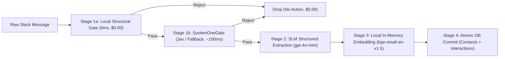

# Specification 03: Sequential Ingestion Pipeline

## 1. Overview & Objectives

The **Ingestion Pipeline** passively extracts relationship intelligence, commitments, and interaction context from conversations and user notes.

Following Google Cloud's **Sequential Pattern**, this pipeline executes as a fixed sequence of four deterministic stages without dynamic model orchestration. This guarantees high throughput, deterministic behavior, and negligible operational cost ($< \$0.0001$ per ingested message).



---

## 2. Pipeline Stages & Detailed Contracts

### Stage 1: Two-Tier Ingestion Gate (Local Structural Filter + SystemOneGate)

The ingestion gate uses a **two-tier defense-in-depth architecture**:
1. **Tier 0 (Local Structural Filter):** Discards non-human messages, bot pings, and trivial noise on local CPU within $< 1\text{ ms}$ at $\$0.00$ cost without making network calls.
2. **Tier 1 (`SystemOneGate`):** Evaluates remaining substantive messages with a fast, calibrated non-autoregressive **System 1 Decision Engine** (TypeSafe AI Jev, with local classifier/regex circuit breaker fallback). It executes in $\approx 70-150\text{ ms}$ and outputs typed, zero-error decisions with calibrated epistemic probabilities.

```python
from typing import Protocol, runtime_checkable, Optional, Literal
from pydantic import BaseModel, Field

# ============================================================================
# 1. Tier 0: Deterministic Local Structural Filter
# ============================================================================
class LocalStructuralFilter:
    BOT_SUBTYPES = ["bot_message", "channel_join", "channel_leave", "pinned_info"]

    @classmethod
    def should_evaluate(cls, event: dict) -> bool:
        # Ignore bot messages, webhooks, or automated system updates
        if event.get("bot_id") or event.get("subtype") in cls.BOT_SUBTYPES:
            return False
        
        text = event.get("text", "").strip()
        tokens = text.split()
        
        # Reject extremely short pings (< 4 words) or pure URL messages
        if len(tokens) < 4:
            return False
        if text.startswith("http://") or text.startswith("https://"):
            return False
            
        return True


# ============================================================================
# 2. Tier 1: SystemOneGate Protocol & Data Contract
# ============================================================================
class IngestionGateDecision(BaseModel):
    should_ingest: bool = Field(
        ..., 
        description="Whether the message contains actionable relationship context, commitments, or meeting notes."
    )
    contains_commitment: bool = Field(
        ..., 
        description="True if an explicit or implied promise, deliverable, or task is mentioned."
    )
    contains_relationship_note: bool = Field(
        ..., 
        description="True if meeting notes, counterparty updates, or relationship intelligence are present."
    )
    category: Literal["COMMITMENT", "MEETING_NOTE", "CASUAL_CHAT", "SYSTEM_NOISE"] = Field(
        default="CASUAL_CHAT",
        description="High-level interaction classification."
    )
    urgency_score: float = Field(
        default=0.0,
        description="Probability-weighted urgency position [0.0 - 2.0]."
    )
    confidence: float = Field(
        ..., 
        ge=0.0, 
        le=1.0, 
        description="Calibrated probability score from the decision engine."
    )


@runtime_checkable
class SystemOneGate(Protocol):
    """Pluggable System 1 Decision Interface."""
    async def evaluate(self, event: dict) -> IngestionGateDecision:
        ...


# ============================================================================
# 3. Pluggable Adapters: TypeSafe AI Jev Adapter & Fallback
# ============================================================================
class JevSystemOneAdapter:
    """
    Primary Adapter: TypeSafe AI Jev System 1 Decision Model.
    Adheres strictly to TypeSafe AI principles (SKILL.md):
    - Uses SDK primitives: Noul (boolean presence), Choice (one-of-set), Score (graded urgency).
    - Asks all questions over structured state in a single parallel System One call.
    - Zero generative hallucination, sub-150ms execution, $0.042/MTok input, free outputs.
    """
    def __init__(self, client: Optional[Any] = None, timeout_s: float = 0.35):
        # Uses AsyncTypeSafeClient from typesafe_sdk
        self.client = client
        self.timeout_s = timeout_s

    async def evaluate(self, event: dict) -> IngestionGateDecision:
        from typesafe_sdk import AsyncTypeSafeClient, Choice, Noul, Score
        
        text = event.get("text", "").strip()
        state = {
            "message": {
                "text": text,
                "user": event.get("user", "unknown"),
                "channel_type": event.get("channel_type", "im")
            }
        }
        
        # Compose independent questions evaluated in parallel:
        questions = {
            # Noul: Condition evaluation (probability of yes)
            "has_actionable_intel": Noul(
                instructions="Does `message.text` contain relationship intelligence, a meeting note, or a commitment worth tracking for an executive?"
            ),
            "has_commitment": Noul(
                instructions="Does `message.text` describe an explicit promise, deliverable, or agreed task?"
            ),
            # Choice: Categorical selection with descriptive criteria
            "category": Choice(
                instructions="What is the primary classification of `message.text`?",
                criteria={
                    "commitment": "A promise, deliverable, or agreed next step",
                    "meeting_note": "A note or summary of a discussion, sync, or contact interaction",
                    "casual_chat": "Routine chatter, greeting, acknowledgment, or banter",
                    "system_noise": "Automated alerts, status check, or trivial ping"
                }
            ),
            # Score: Ordered levels describing concrete situations
            "urgency": Score(
                instructions="How urgent or time-sensitive is the commitment discussed in `message.text`?",
                criteria=[
                    "No explicit deadline or low priority",
                    "Actionable within the next few days",
                    "Urgent deadline due today, tomorrow, or strictly time-critical"
                ]
            )
        }
        
        async with AsyncTypeSafeClient() as client:
            response = await client.system_one(state=state, questions=questions)
            
        intel_prob = response.nouls["has_actionable_intel"].noul
        commitment_prob = response.nouls["has_commitment"].noul
        category_choice = response.choices["category"].choice
        category_conf = response.choices["category"].confidence
        urgency_score = response.scores["urgency"].score
        
        # Code owns the decision logic based on calibrated probabilities:
        should_ingest = (intel_prob >= 0.65) or (category_choice in ("commitment", "meeting_note") and category_conf >= 0.60)
        
        category_map = {
            "commitment": "COMMITMENT",
            "meeting_note": "MEETING_NOTE",
            "casual_chat": "CASUAL_CHAT",
            "system_noise": "SYSTEM_NOISE"
        }
        
        return IngestionGateDecision(
            should_ingest=should_ingest,
            contains_commitment=commitment_prob >= 0.60,
            contains_relationship_note=category_choice == "meeting_note" or "note:" in text.lower(),
            category=category_map.get(category_choice, "CASUAL_CHAT"),
            urgency_score=urgency_score,
            confidence=max(intel_prob, category_conf)
        )


class RegexFallbackAdapter:
    """
    Zero-Dependency Fallback Adapter:
    Used when offline, in isolated local tests, or when Jev circuit breaker trips.
    """
    COMMITMENT_TRIGGERS = [
        r"\b(i will|i'll|let's meet|sending you|send you|follow up|by tomorrow|by friday|deadline|promise)\b",
        r"\b(met with|spoke with|sync with|1-on-1 with|note:)\b"
    ]

    async def evaluate(self, event: dict) -> IngestionGateDecision:
        import re
        text = event.get("text", "").strip()
        lower_text = text.lower()
        
        # Explicit notes always pass
        if lower_text.startswith("note:") or "met with" in lower_text:
            return IngestionGateDecision(
                should_ingest=True,
                contains_commitment="promise" in lower_text or "by " in lower_text,
                contains_relationship_note=True,
                category="MEETING_NOTE",
                urgency_score=1.0,
                confidence=0.95
            )
            
        for pattern in self.COMMITMENT_TRIGGERS:
            if re.search(pattern, text, re.IGNORECASE):
                return IngestionGateDecision(
                    should_ingest=True,
                    contains_commitment=True,
                    contains_relationship_note=False,
                    category="COMMITMENT",
                    urgency_score=1.0,
                    confidence=0.75
                )
                
        return IngestionGateDecision(
            should_ingest=False,
            contains_commitment=False,
            contains_relationship_note=False,
            category="CASUAL_CHAT",
            urgency_score=0.0,
            confidence=0.90
        )


class CompositeSystemOneGate:
    """
    Production Wrapper: Runs Jev with automatic timeout (< 350ms) and
    graceful degradation to RegexFallbackAdapter if the API is unreachable.
    """
    def __init__(self, primary: SystemOneGate, fallback: SystemOneGate, acceptance_threshold: float = 0.65):
        self.primary = primary
        self.fallback = fallback
        self.acceptance_threshold = acceptance_threshold

    async def should_ingest(self, event: dict) -> tuple[bool, Optional[IngestionGateDecision]]:
        # Tier 0: Local Structural Filter
        if not LocalStructuralFilter.should_evaluate(event):
            return False, None
            
        # Tier 1: System 1 Decision Gate (Jev with Fallback)
        try:
            decision = await self.primary.evaluate(event)
        except Exception:
            # Circuit breaker trip -> seamless fallback
            decision = await self.fallback.evaluate(event)
            
        passes = decision.should_ingest and (decision.confidence >= self.acceptance_threshold)
        return passes, decision
```

### Stage 2: SLM Information Extraction (Strict Pydantic Schema)

Filtered messages are passed to a lightweight model (`gpt-4o-mini` or Claude 3.5 Haiku) with strict JSON schema enforcement via Pydantic.

```python
from pydantic import BaseModel, Field
from typing import Optional
from datetime import datetime

class ExtractedInteraction(BaseModel):
    contact_name: str = Field(
        ..., 
        description="Name of the external or internal counterparty discussed or interacted with."
    )
    contact_email: Optional[str] = Field(
        None, 
        description="Email address of the contact if mentioned."
    )
    summary: str = Field(
        ..., 
        description="1-2 sentence essence of the exchange, interaction, or discussion."
    )
    commitment: Optional[str] = Field(
        None, 
        description="Specific promise, deliverable, or agreed task (e.g. 'Send budget proposal by Thursday')."
    )
    due_date: Optional[str] = Field(
        None, 
        description="ISO-8601 formatted timestamp or date if an explicit or relative deadline is detected."
    )
    importance: str = Field(
        default="MEDIUM",
        description="Priority level of the interaction: 'LOW', 'MEDIUM', or 'HIGH'."
    )
```

**System Prompt Contract:**
```text
You are a specialized relationship intelligence extractor.
Extract counterparty names, conversation summaries, and actionable commitments.
Never invent names or promises. If no commitment is made, leave commitment and due_date null.
Resolve relative dates (e.g., 'tomorrow', 'next Monday') relative to the reference date: {current_iso_timestamp}.
```

### Stage 3: In-Memory Local Embeddings (Zero API Cost)

Rather than paying $0.02 per 1M tokens with external APIs and incurring network roundtrips, embeddings are generated locally on CPU using `fastembed` with the `bge-small-en-v1.5` model:

- **Dimensions:** 384
- **Runtime:** $< 15\text{ ms}$ on host CPU
- **Memory Footprint:** $\approx 130\text{ MB}$
- **Cost:** $\$0.00$

```python
from fastembed import TextEmbedding

# Initialized once as a singleton
embedder = TextEmbedding(model_name="BAAI/bge-small-en-v1.5")

def generate_embedding(text: str) -> list[float]:
    # Returns 384-dimensional dense vector
    return list(embedder.embed([text]))[0].tolist()
```

### Stage 4: Atomic DB Commit

Both the contact record (upsert) and the interaction record (insert) are committed within a single database transaction:
1. `contacts`: Update `last_interaction_ts` to message timestamp; insert contact if non-existent.
2. `interactions`: Insert summary, raw text, commitment, due date, and embedding vector.

---

## 3. Scope Boundaries for Ingestion

### In-Scope
- Pre-filtering incoming Slack DM messages and channel events where bot is present.
- Support for explicit manual notes (e.g., `note: Met with Sarah from Acme Corp, promised to send the revised budget by Friday`).
- Extraction of promises, deadlines, and contact names into validated Pydantic structures.
- Local CPU embedding generation.

### Out-of-Scope
- Eavesdropping on uninvited public or private channels.
- Ingestion of non-text attachments (PDF attachments, audio files, image OCR) during Stage 1.
- Dynamic multi-model voting or LLM-based ingestion orchestrators.

---

## 4. Verification Plan

| Test Case ID | Test Description | Input Data | Expected Result |
| :--- | :--- | :--- | :--- |
| **TEST-INGEST-01** | Tier 0 Filter: Bot message rejection | `subtype="bot_message"`, `text="Jira bot updated PROJ-123"` | `LocalStructuralFilter.should_evaluate()` returns `False`; zero network calls. |
| **TEST-INGEST-02** | Tier 0 Filter: Short conversational ping | `text="hey there"` | `LocalStructuralFilter.should_evaluate()` returns `False`. |
| **TEST-INGEST-03** | Tier 1 Jev Gate: Note Acceptance | `text="note: Met with Dave, agreed on Q4 roadmap"` | `SystemOneGate.evaluate()` returns `should_ingest=True`, `category="MEETING_NOTE"`, `confidence >= 0.90`. |
| **TEST-INGEST-04** | Tier 1 Jev Gate: Non-Regex Commitment | `text="Can you take a look at the revised deck before our call?"` | Jev returns `should_ingest=True`, `contains_commitment=True`, `confidence >= 0.75` (catches non-regex pattern). |
| **TEST-INGEST-05** | Tier 1 Circuit Breaker Fallback | Jev API simulated 500 error / timeout | `CompositeSystemOneGate` seamlessly catches error, calls `RegexFallbackAdapter`, and proceeds deterministically. |
| **TEST-INGEST-06** | SLM Extraction Schema Compliance | `text="Sync with Alex from Acme, promised to deliver the pitch deck by tomorrow at 5pm"` | Parses into `ExtractedInteraction` with `contact_name="Alex"`, commitment containing "pitch deck", and valid `due_date`. |
| **TEST-INGEST-07** | Embedding Generation Check | `text="Delivering the Q3 budget deck to leadership"` | Returns 384-element float list; vector norm $\approx 1.0$. |
| **TEST-INGEST-08** | Atomic Upsert Verification | Insert interaction for "Alex"; insert second interaction for "Alex" | Single contact record exists in `contacts` with updated `last_interaction_ts`; two records exist in `interactions`. |
