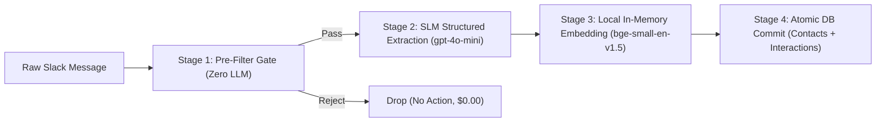

# Specification 03: Sequential Ingestion Pipeline

## 1. Overview & Objectives

The **Ingestion Pipeline** passively extracts relationship intelligence, commitments, and interaction context from conversations and user notes.

Following Google Cloud's **Sequential Pattern**, this pipeline executes as a fixed sequence of four deterministic stages without dynamic model orchestration. This guarantees high throughput, deterministic behavior, and negligible operational cost ($< \$0.0001$ per ingested message).



---

## 2. Pipeline Stages & Detailed Contracts

### Stage 1: The Pre-Filter Gate (Zero-Cost Regex & Heuristics)

The pre-filter rejects irrelevant traffic within $< 5\text{ ms}$ before making any model calls.

```python
# Heuristic rules for ingestion gate
class IngestionFilter:
    COMMITMENT_TRIGGERS = [
        r"\b(i will|i'll|let's meet|sending you|send you|follow up|by tomorrow|by friday|deadline|promise)\b",
        r"\b(met with|spoke with|sync with|1-on-1 with|note:)\b"
    ]
    BOT_SUBTYPES = ["bot_message", "channel_join", "channel_leave", "pinned_info"]

    @classmethod
    def should_process(cls, event: dict) -> bool:
        # 1. Ignore bot messages, webhooks, or automated system updates
        if event.get("bot_id") or event.get("subtype") in cls.BOT_SUBTYPES:
            return False
        
        text = event.get("text", "").strip()
        tokens = text.split()
        
        # 2. Reject extremely short pings (< 4 words) or pure URL messages
        if len(tokens) < 4:
            return False
        if text.startswith("http://") or text.startswith("https://"):
            return False
            
        # 3. Direct DM notes always pass
        if text.lower().startswith("note:") or "met with" in text.lower():
            return True
            
        # 4. Check for commitment or relationship markers
        import re
        for pattern in cls.COMMITMENT_TRIGGERS:
            if re.search(pattern, text, re.IGNORECASE):
                return True
                
        return False
```

### Stage 2: SLM Information Extraction (Strict Pydantic Schema)

Filtered messages are passed to a lightweight model (`gpt-4o-mini` or Claude 3.5 Haiku) with strict JSON schema enforcement via Pydantic.

```python
from pydantic import BaseModel, Field
from typing import Optional
from datetime import datetime

class ExtractedInteraction(BaseModel):
    contact_name: str = Field(
        ..., 
        description="Name of the external or internal counterparty discussed or interacted with."
    )
    contact_email: Optional[str] = Field(
        None, 
        description="Email address of the contact if mentioned."
    )
    summary: str = Field(
        ..., 
        description="1-2 sentence essence of the exchange, interaction, or discussion."
    )
    commitment: Optional[str] = Field(
        None, 
        description="Specific promise, deliverable, or agreed task (e.g. 'Send budget proposal by Thursday')."
    )
    due_date: Optional[str] = Field(
        None, 
        description="ISO-8601 formatted timestamp or date if an explicit or relative deadline is detected."
    )
    importance: str = Field(
        default="MEDIUM",
        description="Priority level of the interaction: 'LOW', 'MEDIUM', or 'HIGH'."
    )
```

**System Prompt Contract:**
```text
You are a specialized relationship intelligence extractor.
Extract counterparty names, conversation summaries, and actionable commitments.
Never invent names or promises. If no commitment is made, leave commitment and due_date null.
Resolve relative dates (e.g., 'tomorrow', 'next Monday') relative to the reference date: {current_iso_timestamp}.
```

### Stage 3: In-Memory Local Embeddings (Zero API Cost)

Rather than paying $0.02 per 1M tokens with external APIs and incurring network roundtrips, embeddings are generated locally on CPU using `fastembed` with the `bge-small-en-v1.5` model:

- **Dimensions:** 384
- **Runtime:** $< 15\text{ ms}$ on host CPU
- **Memory Footprint:** $\approx 130\text{ MB}$
- **Cost:** $\$0.00$

```python
from fastembed import TextEmbedding

# Initialized once as a singleton
embedder = TextEmbedding(model_name="BAAI/bge-small-en-v1.5")

def generate_embedding(text: str) -> list[float]:
    # Returns 384-dimensional dense vector
    return list(embedder.embed([text]))[0].tolist()
```

### Stage 4: Atomic DB Commit

Both the contact record (upsert) and the interaction record (insert) are committed within a single database transaction:
1. `contacts`: Update `last_interaction_ts` to message timestamp; insert contact if non-existent.
2. `interactions`: Insert summary, raw text, commitment, due date, and embedding vector.

---

## 3. Scope Boundaries for Ingestion

### In-Scope
- Pre-filtering incoming Slack DM messages and channel events where bot is present.
- Support for explicit manual notes (e.g., `note: Met with Sarah from Acme Corp, promised to send the revised budget by Friday`).
- Extraction of promises, deadlines, and contact names into validated Pydantic structures.
- Local CPU embedding generation.

### Out-of-Scope
- Eavesdropping on uninvited public or private channels.
- Ingestion of non-text attachments (PDF attachments, audio files, image OCR) during Stage 1.
- Dynamic multi-model voting or LLM-based ingestion orchestrators.

---

## 4. Verification Plan

| Test Case ID | Test Description | Input Data | Expected Result |
| :--- | :--- | :--- | :--- |
| **TEST-INGEST-01** | Noise Filter: Bot message rejection | `subtype="bot_message"`, `text="Jira bot updated PROJ-123"` | `should_process()` returns `False`; LLM is never called. |
| **TEST-INGEST-02** | Noise Filter: Short conversational ping | `text="hey there"` | `should_process()` returns `False`. |
| **TEST-INGEST-03** | Noise Filter: Explicit note acceptance | `text="note: Met with Dave, agreed on Q4 roadmap"` | `should_process()` returns `True`. |
| **TEST-INGEST-04** | SLM Extraction Schema Compliance | `text="Sync with Alex from Acme, promised to deliver the pitch deck by tomorrow at 5pm"` | Parses into `ExtractedInteraction` with `contact_name="Alex"`, commitment containing "pitch deck", and valid `due_date`. |
| **TEST-INGEST-05** | Embedding Generation Check | `text="Delivering the Q3 budget deck to leadership"` | Returns 384-element float list; vector norm $\approx 1.0$. |
| **TEST-INGEST-06** | Atomic Upsert Verification | Insert interaction for "Alex"; insert second interaction for "Alex" | Single contact record exists in `contacts` with updated `last_interaction_ts`; two records exist in `interactions`. |
