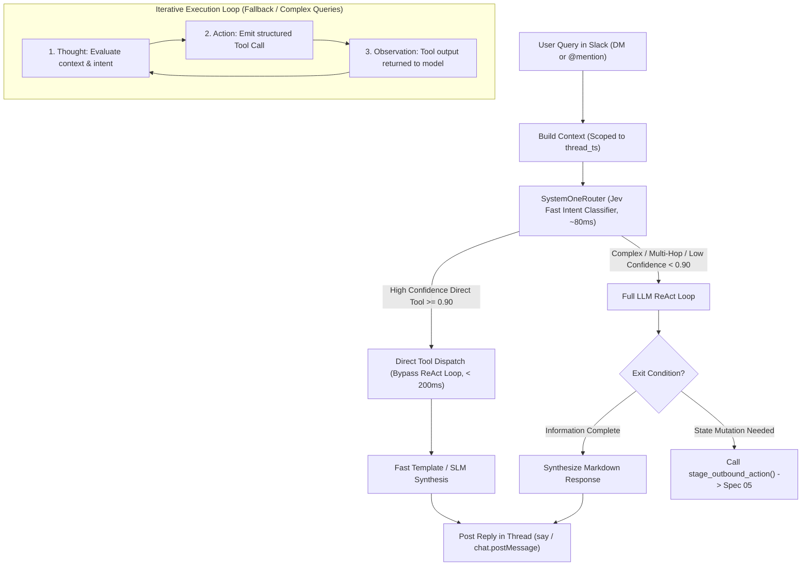

# Specification 04: Conversational ReAct Agent

## 1. Overview & Objectives

The **Conversational Agent** provides an interactive intelligence assistant inside Slack DMs and `@bot` mentions.

Following Google Cloud's **ReAct Pattern (Reason and Act)**, the agent iteratively reasons about user intent, executes deterministic retrieval tools against the dual-memory persistence layer, and synthesizes accurate, grounded answers.



---

## 2. Session Isolation & Context Boundary

To prevent cross-conversation context bleeding and token explosion:
1. **Thread Boundary (`thread_ts`):** Every distinct conversation thread in Slack acts as an independent session. The agent only loads messages matching the current `thread_ts`.
2. **Context Window Capping:** A maximum of 10 prior conversation turns in the current thread are loaded into the prompt context.
3. **Prompt Caching Structure:** System prompts and static tool schemas are positioned at the beginning of the prompt to take advantage of provider prompt caching discounts (up to 90% savings on input tokens).

---

## 3. Tool Registry Contracts

The agent has access to a strictly defined set of deterministic query tools and one staging tool:

### 3.1 `search_commitments`
Retrieves pending or fulfilled promises, action items, and deadlines.
```python
def search_commitments(
    query: str,
    status: Optional[str] = "PENDING",
    due_before: Optional[str] = None
) -> list[dict]:
    """
    Search commitments using hybrid search (vector similarity + SQL status filter).
    
    Args:
        query: Free-text description of the task or commitment (e.g. 'budget deck').
        status: Filter by status ('PENDING', 'FULFILLED', 'CANCELLED'). Defaults to 'PENDING'.
        due_before: Optional ISO-8601 deadline to filter upcoming commitments.
    """
```

### 3.2 `query_relationship_graph`
Looks up contacts, roles, company affiliations, and last interaction timestamps.
```python
def query_relationship_graph(
    contact_name: Optional[str] = None,
    company: Optional[str] = None,
    topic: Optional[str] = None
) -> list[dict]:
    """
    Query contacts table and semantic summaries to identify counterparties.
    
    Args:
        contact_name: Specific person's name or alias.
        company: Organization or company domain name.
        topic: Semantic keyword (e.g. 'investor', 'compiler engineer').
    """
```

### 3.3 `get_meeting_context`
Pulls recent chronological interaction logs and notes for a specific person.
```python
def get_meeting_context(
    contact_name: str,
    limit: int = 5
) -> list[dict]:
    """
    Fetch the most recent interactions, summaries, and commitments for a given contact.
    
    Args:
        contact_name: Full or partial name of the contact.
        limit: Maximum number of recent interactions to retrieve (default: 5).
    """
```

### 3.4 `stage_outbound_action` (HITL Gateway Bridge)
**CRITICAL RULE:** This tool never executes external state-modifying APIs. It writes a staged draft into `action_drafts` and emits a Slack Block Kit interactive card.
```python
def stage_outbound_action(
    action_type: str,
    recipient: str,
    summary: str,
    payload: dict
) -> dict:
    """
    Stage an outbound state-altering action for Human-in-the-Loop review.
    
    Args:
        action_type: 'SEND_SLACK_DM', 'GMAIL_DRAFT', 'CALENDAR_INVITE', or 'POST_CHANNEL'.
        recipient: Target contact or channel name.
        summary: High-level explanation of the action proposed.
        payload: Exact parameters (recipient ID, message text, event times).
    Returns:
        draft_id: Unique UUID of the staged action.
    """
```

---

## 4. Fast-Path Routing & Tiered Execution Architecture

Rather than forcing every user message through a multi-step, multi-second ReAct reasoning loop (Thought $\rightarrow$ Action $\rightarrow$ Observation $\rightarrow$ Synthesize), Knappy implements an upstream **System 1 Fast Intent Router** powered by TypeSafe AI Jev, following TypeSafe's **Intent Routing & Speculative Fan-Out Pattern** (`docs/skills/SKILL.md`):

```python
from typesafe_sdk import AsyncTypeSafeClient, Choice, Score, Noul
from typing import Optional, Any

class SystemOneRouter:
    """
    Sub-100ms Fast Intent Router built on TypeSafe System One (Jev).
    Uses TypeSafe primitives:
    - Choice: Selects single target tool handler or ReAct escalation.
    - Score: Measures query complexity to distinguish simple lookups from multi-hop reasoning.
    - Noul: Detects mutating outbound actions that must pass to HITL gateway.
    """
    INTENT_CONFIDENCE_THRESHOLD = 0.90
    COMPLEXITY_CEILING = 1.0  # < 1.0 means simple single-step lookup

    def __init__(self, react_agent: Any):
        self.react_agent = react_agent

    async def route_and_execute(self, query: str, thread_context: dict) -> str:
        # Step 1: Prepare structured state with backticked path references
        state = {
            "request": {
                "query": query,
                "recent_thread_messages": thread_context.get("recent_messages", [])[-2:]
            }
        }

        # Step 2: Compose independent questions evaluated concurrently in one call
        questions = {
            "intent": Choice(
                instructions="What is the primary operational intent of `request.query`?",
                criteria={
                    "search_commitments": "Searching for promises, deliverables, tasks, or deadlines",
                    "query_contact": "Looking up a counterparty's contact info, company, role, or background",
                    "meeting_context": "Retrieving notes, summaries, or history from a past meeting",
                    "stage_action": "Requesting to draft, prepare, or send an outbound communication or follow-up",
                    "chitchat": "Casual greetings, acknowledgments, or conversational banter",
                    "complex_reasoning": "Open-ended advice, multi-entity correlation, or ambiguous request"
                }
            ),
            "complexity": Score(
                instructions="How complex is `request.query` to fulfill?",
                criteria=[
                    "Simple single-step database lookup or standard procedure",
                    "Requires multi-step lookup, entity correlation, or conditional logic",
                    "Ambiguous, open-ended analysis, or requires deep iterative reasoning"
                ]
            ),
            "is_outbound_action": Noul(
                instructions="Does `request.query` ask to perform a real-world action or draft a communication?"
            )
        }

        # Step 3: Fast System 1 Inference (~80ms, 0% type error)
        try:
            async with AsyncTypeSafeClient() as client:
                response = await client.system_one(state=state, questions=questions)
        except Exception:
            # Circuit breaker: Fallback to full ReAct loop on API error or timeout
            return await self.react_agent.run(query, thread_context)

        intent = response.choices["intent"]
        complexity = response.scores["complexity"]
        is_action = response.nouls["is_outbound_action"]

        # Step 4: Route to Optimal Handler (Code owns the decision logic)
        # Fast Path A: High-confidence simple query -> Direct Tool Dispatch (< 250ms end-to-end)
        if intent.confidence >= self.INTENT_CONFIDENCE_THRESHOLD and complexity.score < self.COMPLEXITY_CEILING:
            if intent.choice == "search_commitments":
                results = search_commitments(query=query)
                return self.format_commitment_results(results, query)
                
            elif intent.choice == "query_contact":
                results = query_relationship_graph(contact_name=query)
                return self.format_contact_results(results, query)
                
            elif intent.choice == "meeting_context":
                results = get_meeting_context(contact_name=query)
                return self.format_meeting_results(results, query)

            elif intent.choice == "chitchat":
                return "Hey! How can I help you manage your contacts, commitments, or schedule today?"

        # Fast Path B: Explicit Outbound Action -> Route immediately to Staging Tool
        if is_action.noul >= 0.75:
            # Code extracts recipient and draft intent, calls staging tool -> Spec 05
            return await self.react_agent.run(query, thread_context)

        # Slow Path: Complex Multi-Hop or Low Confidence -> Escalate to full ReAct Reasoning Loop
        return await self.react_agent.run(query, thread_context)

### 4.2 Latency and Cost Matrix

| Path | Query Type | Example | Resolution Engine | Latency | Cost |
| :--- | :--- | :--- | :--- | :--- | :--- |
| **Fast Path** | Single deterministic query | `"What did I promise Alex?"` | Jev Router (~80ms) + Direct Tool (~15ms) + Template | $\approx 250\text{ ms}$ | $<\$0.00005$ |
| **ReAct Path** | Ambiguous or multi-hop | `"Find my last note with Acme and draft an email to the CEO"` | Jev Router $\rightarrow$ ReAct Loop (2 tool calls + synthesis) | $\approx 2,500\text{ ms}$ | $\approx \$0.0008$ |
| **Escalated Tier** | Nuanced executive synthesis | `"Analyze our conversation history with Acme and advise on renewal terms"` | Escalate to Claude 3.5 Sonnet / GPT-4o | $\approx 5,000\text{ ms}$ | $\approx \$0.015$ |

---

## 5. Scope Boundaries

### In-Scope
- Sub-100ms fast-path intent routing using Jev.
- Bounded ReAct reasoning loop (max 3 tool iterations to prevent infinite loops) for complex queries.
- Thread-scoped conversation memory using `thread_ts`.
- Structured function calling (OpenAI / Anthropic standard tool call schemas).
- Safe error handling: When a tool returns no records, synthesize an honest negative reply ("I couldn't find any commitments regarding...").

### Out-of-Scope
- Unbounded web search scraping or unrestricted arbitrary shell execution.
- Blind outbound writing to external APIs without HITL approval card.
- Cross-channel context merging without explicit user permission.

---

## 6. Verification Plan

| Test Case ID | Test Focus | Input Query | Expected Behavior |
| :--- | :--- | :--- | :--- |
| **TEST-REACT-01** | Fast-Path Intent Routing | `"What did I promise to send Alex?"` | Intent confidence $\ge 0.90$ and complexity $< 1.0$; `search_commitments` is called and the ReAct loop is not; reply returns in $< 400\text{ ms}$. |
| **TEST-REACT-02** | Multi-Hop ReAct Escalation | `"Find my last note with Alex and draft a follow-up email"` | Jev routes to `FULL_REACT_LOOP`; agent executes multi-step ReAct sequence. |
| **TEST-REACT-03** | Observation Processing | Mock tool returns: `[{contact: "Alex", commitment: "Send budget by Thursday"}]` | Agent outputs: `"Alex from Acme Corp promised to send the revised budget by Thursday."` |
| **TEST-REACT-04** | Missing Data Handling | Search tool returns empty list `[]` | Agent clearly communicates that no matching commitment was found; does not hallucinate. |
| **TEST-REACT-05** | Action Staging Boundary | `"Follow up with Alex and ask for the deck"` | Agent invokes `stage_outbound_action()`; does NOT invoke any external messaging API directly. |
| **TEST-REACT-06** | Thread Memory Isolation | Ask question in Thread A; ask unrelated question in Thread B | Context from Thread A is not present in prompt for Thread B. |
| **TEST-REACT-07** | Max Loop Termination | Tool returns ambiguous results repeatedly | Agent stops at iteration 3 and asks user for clarification rather than looping infinitely. |
