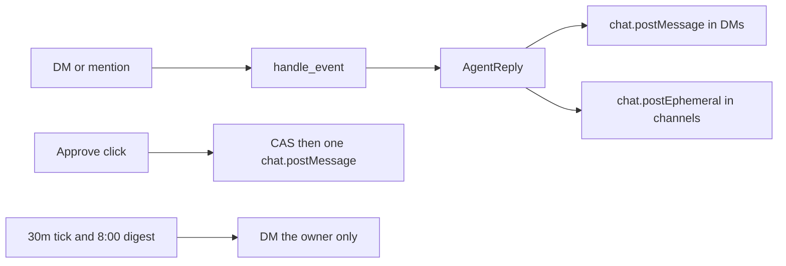

# Specification 08: Slack Egress, Reminders, and Per-User Memory

## 1. Overview & Objectives

Knappy already receives DMs and mentions. This spec makes the running process answer in Slack, send an approved Slack DM exactly once, and DM proactive reminders to the person who owns the memory.

Each Slack user has a private Knappy inside one workspace install. Contacts, interactions, and briefing items are keyed by `owner_user_id` (the Slack user id of the person Knappy is assisting). Two people who both know an Alex do not share a row.

---

## 2. Delivery Rules

| Situation | Slack call |
| :--- | :--- |
| DM with no `thread_ts` | `chat.postMessage` in that DM, not threaded |
| Mention, or a message that already has `thread_ts` | `chat.postMessage` in that thread |
| Shared channel answer or approval card | `chat.postEphemeral` to the user who asked |

A `note:` message posts the logged-interaction acknowledgement. A commitment question posts the stored answer. An outbound request posts the Approve, Edit, and Cancel card.

At startup, `auth.test` supplies `team_id` as `workspace_id`. If that call fails, `KNAPPY_WORKSPACE_ID` is the fallback.

---

## 3. Approved Sends and Reminders

`SEND_SLACK_DM` calls `chat.postMessage` to `payload.recipient_identifier` with `payload.staged_content`. Gmail, calendar, and channel posts have no provider: the draft moves to `FAILED` and the failed receipt is shown. Compare-and-swap still allows only the first approval to execute.

`python -m knappy.main` runs a background tick: commitment scan every 30 minutes; cadence scan and morning digest at 8:00 AM, once per local day. The sender DMs `owner_user_id` when that column is set, otherwise the engine user. `python -m knappy.scheduler --run-now` uses the same sender when `SLACK_BOT_TOKEN` is present.

---

## 4. Per-User Storage

`contacts`, `interactions`, and `briefing_items` gain `owner_user_id TEXT NOT NULL`. The contact unique key is `(workspace_id, owner_user_id, name)` in both SQLite and PostgreSQL. Ingest, search, drafts, and relationship lookups filter on the caller:

- A DM uses `event.user`.
- An `@Knappy` mention uses the user who mentioned it.
- Reminders and digest items DM that owner only.

`KNAPPY_DATABASE_URL` starting with `postgres://` or `postgresql://` selects the Postgres repository. Any other URL stays SQLite. SQLite remains the default for tests.

---

## 5. Scope

### In-Scope
- Posting replies, acknowledgements, and approval cards from the Bolt client.
- One Slack DM per approved `SEND_SLACK_DM`.
- Heartbeat DMs from the running process and from `--run-now`.
- `owner_user_id` isolation and a Postgres repository.

### Out-of-Scope
- Gmail, Google Calendar, and unsolicited `POST_CHANNEL` providers.
- A public HTTP webhook. Socket Mode stays outbound.
- More than one live worker. Two processes would both answer the same event.

---

## 6. Verification

| Test Case ID | Procedure | Expected Outcome |
| :--- | :--- | :--- |
| **TEST-EGRESS-01** | DM a `note:` with a fake Slack client. | Exactly one `chat.postMessage` acknowledgement. |
| **TEST-EGRESS-02** | Ask what you promised Alex, then ask to follow up. | One answer post, then one card containing Approve. |
| **TEST-EGRESS-03** | Approve the staged Slack DM twice. | One external `chat.postMessage`. The second click does not send. |
| **TEST-EGRESS-04** | A second user stores their own Alex. | The first user's commitment search does not return that row. |
| **TEST-EGRESS-05** | Mention Knappy in a channel. | The answer is `chat.postEphemeral` to that user. |
