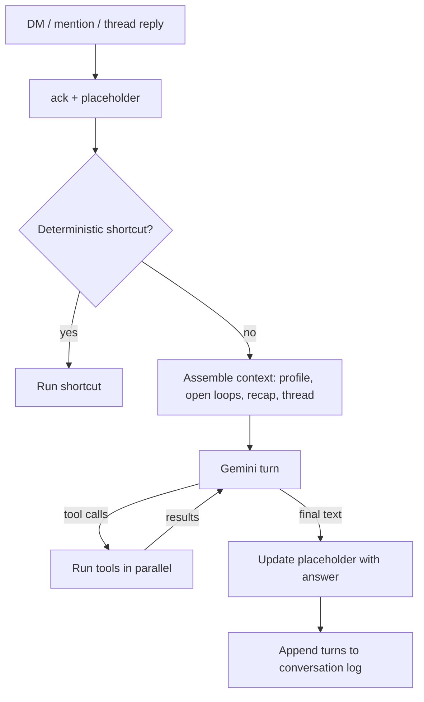

# Specification 12: Agent Loop v2

## 1. Overview & Objectives

Today a regex router decides what Knappy may answer, and refuses the rest ([GAP-02](./00_gap_analysis.md)). The ReAct loop runs at most three steps and returns early with templates ([GAP-03](./00_gap_analysis.md)).

This spec makes one model-driven tool loop the default path for every message. The router shrinks to a few deterministic shortcuts. Every answer is written by the model from what the tools returned.

**Supersedes:** [Spec 04](./04_conversational_react_agent.md) §2 (session boundary → §5 here), §4 (fast-path routing and intent tiers → §2–§3 here), and §5 (scope, including the web search exclusion). Spec 04 §3's existing tool contracts and its HITL staging boundary (TEST-REACT-05) still hold. TEST-REACT-01 (fast path skips the loop) is retired.



---

## 2. Deterministic Shortcuts

Only these skip the model. Everything else goes to the loop.

| Shortcut | Trigger | Behavior |
| :--- | :--- | :--- |
| Explicit note | Message starts with `note:` | Run the existing ingestion pipeline (`knappy/ingestion/pipeline.py`) and post the acknowledgement. Also append to the conversation log. |
| Block actions | Approve, Edit, Cancel, Done, Snooze | Unchanged: `knappy/slack/actions.py` → `ApprovalGateway`. |
| Budget exhausted | [Spec 11](./11_model_layer_gemini.md) §5 | Post the limit message. |

`SystemOneRouter`, `heuristic_intent`, `_compose_reply`, `_show_last`, and `_is_general_question` (`knappy/agent/router.py`) are deleted. `knappy/runtime.py` no longer runs the ingestion gate on DMs; learning from conversations moves to the memory reconciler ([Spec 13](./13_memory_system.md)).

---

## 3. The Loop

```python
class AgentLoop:
    MAX_STEPS = 8          # model turns per user message
    WALL_CLOCK_S = 60      # whole message, all steps

    async def run(self, message: InboundMessage) -> AgentReply: ...
```

Rules:

1. Each step sends the model the system prompt (§4), the conversation contents, and all tool declarations.
2. When the model returns tool calls, run them concurrently, append each result as a function response, and take another step. **No tool ends the loop on its own.** The model writes every final answer.
3. `stage_outbound_action` is the exception in one respect: the reply carries the approval card blocks from its result, along with the model's final text.
4. Tool errors are returned to the model as results (`{"error": "..."}`), not raised. The model decides whether to retry, try something else, or explain.
5. If `MAX_STEPS` or `WALL_CLOCK_S` is hit, take one last turn with tools disabled and the instruction to answer with what it has and say what is missing.
6. Concurrent messages in the same conversation are processed in order: one `asyncio.Lock` per conversation key.

### Tool Registry

The registry (`knappy/agent/tools.py`) keeps its current shape: async methods with typed arguments, called by name. Each tool now declares a Pydantic argument model and a one-line description used for the Gemini declaration. Wave 1 tools:

| Tool | Source spec | Gated? |
| :--- | :--- | :--- |
| `memory_search`, `memory_read`, `remember`, `forget` | [13](./13_memory_system.md) | No |
| `search_commitments`, `query_relationship_graph`, `get_meeting_context` | 04 (existing) | No |
| `search_slack_history` | [09](./09_slack_history_context.md) (existing) | No |
| `web_search`, `fetch_url` | [14](./14_web_research.md) | No |
| `read_file`, `create_document` | [15](./15_files_and_documents.md) | No (own DM only) |
| `complete_commitment`, `add_commitment` | this spec | No (own data) |
| `stage_outbound_action` | [05](./05_hitl_approval_gateways.md) | **Yes**, always |

`complete_commitment` and `add_commitment` let a user say "I sent Alex the deck" or "remind me to call mom Friday" without the `note:` prefix.

---

## 4. System Prompt Assembly

Built once per message, in this order, stable parts first so Gemini's prompt cache applies:

1. **Identity and rules** (static): who Knappy is, the operating principles from [Spec 01 §0.1](./01_system_architecture_and_scope.md), formatting rules for Slack mrkdwn, when to use tools, that outbound actions are always staged and never claimed as sent.
2. **Current time and user timezone** (from Slack `users.info`, cached).
3. **User profile one-pager** ([Spec 13](./13_memory_system.md) §4), including autonomy calibration and communication style.
4. **Open loops:** up to 15 open commitments and active workstreams with ids.
5. **Conversation recap:** the stored recap for this conversation when it is longer than the window (Spec 13 §4).
6. Then the conversation contents: the last 20 turns of this conversation from the log, then the new message.

---

## 5. Sessions

| Context | Conversation key | Window |
| :--- | :--- | :--- |
| DM, top-level message | `dm:{channel}` | One rolling conversation. A gap over 6 hours starts a new segment: the previous segment is summarized into the recap. |
| DM thread | `thread:{channel}:{thread_ts}` | That thread only. |
| Mention in a channel | `thread:{channel}:{thread_ts or ts}` | That thread only. |
| Reply in a proactive message thread | `thread:{channel}:{thread_ts}` | Seeded with the proactive message ([Spec 16](./16_proactive_v2.md)). |

Long-term memory (profile, records) is shared across all of an owner's conversations. Conversation turns are not, except through the reconciler and `memory_search`.

---

## 6. Slack UX

- **DMs:** post a placeholder (`_thinking…_`) right after ack. While tools run, update it with a short status (`_searching the web…_`, `_reading report.pdf…_`). Replace it with the final answer via `chat.update`. Answers longer than Slack's text limit are split, or delivered as a document ([Spec 15](./15_files_and_documents.md)).
- **Channels:** ephemeral messages cannot be updated, so add an `:eyes:` reaction to the user's message (`reactions:write`), post the ephemeral answer, then remove the reaction.
- **Failure:** any unhandled error replaces the placeholder with a short apology and a reference id that matches the log line. The user never sees silence.

`build_say` (`knappy/slack/egress.py`) gains `update(channel, ts, text, blocks)` and `react(channel, ts, name, on)` alongside the current post.

---

## 7. Scope

### In-Scope
- `AgentLoop` replacing `ReActAgent` and `SystemOneRouter`.
- Prompt assembly, sessions, per-conversation ordering, placeholder UX.
- `add_commitment`, `complete_commitment` tools.

### Out-of-Scope
- Multi-agent orchestration and sub-agents.
- Background tasks that keep working after the reply (wave 2+).
- Voice and calls.

---

## 8. Verification

All offline tests use `FakeModel` ([Spec 11](./11_model_layer_gemini.md)).

| Test Case ID | Procedure | Expected Outcome |
| :--- | :--- | :--- |
| **TEST-LOOP-01** | DM "what's the capital of Peru?"; fake model answers without tools. | Answer posted by updating the placeholder. No refusal text anywhere in the codebase. |
| **TEST-LOOP-02** | Fake model calls `memory_search`, then `search_commitments`, then answers. | Three model turns. The final text is the model's, not a template. |
| **TEST-LOOP-03** | Fake model loops calling tools forever. | Stops at `MAX_STEPS`, takes one tool-less turn, posts an answer. |
| **TEST-LOOP-04** | A tool raises. | The model receives `{"error": ...}` and its answer is posted. |
| **TEST-LOOP-05** | "Follow up with Alex"; model stages a DM. | The approval card is posted. No `chat.postMessage` to Alex. |
| **TEST-LOOP-06** | Two DMs arrive in the same conversation 50 ms apart. | Processed in order. The second sees the first's turns. |
| **TEST-LOOP-07** | `handle_event` raises. | The placeholder becomes the error message with a reference id. |
| **TEST-LOOP-08** | `note: met Sam, promised the deck Friday`. | Pipeline shortcut runs. No model turn. Turn logged. |
