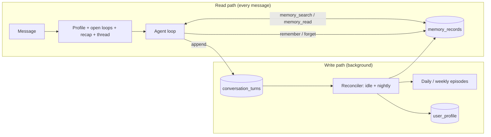

# Specification 13: Memory System

## 1. Overview & Objectives

Knappy forgets every conversation on restart and has no idea who you are ([GAP-04, GAP-05](./00_gap_analysis.md)). This spec gives it durable memory modeled on Instinct's design, as reverse-engineered by [Supermemory](https://supermemory.ai/blog/reverse-engineering-instinct-memory/) and [agentnativedev](https://agentnativedev.medium.com/memory-system-behind-10b-invite-only-personal-agent-d809b8366e9d).

It also adopts the principles in Ashwin Gopinath's [The Instinct Thesis: Why Memory Is Becoming the Moat](https://x.com/ashwingop/article/2093026452929405356). The author has no inside knowledge of Instinct, so this spec uses that article as design philosophy, not as a description of Instinct's internals.

The core idea: **memory is a compiler, not an attic.** The expensive work happens on the write path. A background reconciler decides what is worth admitting, then compiles it into small, typed, aliased beliefs, each traceable to where it came from, plus a profile one-pager. The read path is cheap: the profile is always in the prompt, and the agent pulls deeper records on demand with keyword search. Raw conversation is the compiler's source. It is kept so memory can be recompiled, but it is never put back into the prompt wholesale.



### What we take from Instinct, and what we change

| Instinct | Knappy |
| :--- | :--- |
| Markdown files in git, grouped by folder (`entities/people`, `knowledge/preferences`, …) | Rows in `memory_records` with a `type` column. Version history via `supersedes` instead of git commits. Works in SQLite and Postgres. |
| Aliases in frontmatter to make grep find records | `aliases` column, indexed by full-text search together with title and body. |
| Grep only; paraphrases miss | Full-text search first. Embeddings as an optional second signal (§5) so "Italian noodles" can find "pasta". |
| Reconciliation once a day (~23 h lag) | After a conversation goes idle (default 20 min) **and** nightly. Explicit `remember` writes immediately. |
| Profile one-pager in every prompt | Same: `user_profile`, ≤ 1,500 tokens. |
| Compaction recap for long conversations | Same: `conversation_recaps`. |
| Forgetting mostly manual | `expires_at` on time-bound records, plus an explicit `forget` tool that cascades through provenance (§3.2). |
| No procedural memory | Out of scope for wave 1 (§8). |

### What we take from the Instinct Thesis, and what we defer

| Thesis | Wave 1 decision |
| :--- | :--- |
| **Admission utility:** only store what has expected future value. | Adopted. The reconciler answers three questions and scores every proposed op. Ops below the threshold are dropped and logged (§3.3). |
| **Semantic ledger:** append-only log of admitted events and state changes, with provenance. | Adopted as `memory_events` (§2). |
| **Provenance:** every belief knows its sources, so revoking a source retires everything derived from it. | Adopted as `memory_provenance` (§2). `forget` and source deletion cascade (§3.2). |
| **Commitment scratchpad:** unresolved subgoals with conditions ("if silent by Thursday, escalate"). | Adopted as `next_check_at` and `on_no_progress` on commitments (§2). |
| **Discard the raw stream after digestion.** | **Deferred.** In wave 1 the reconciler will make mistakes, and keeping the source lets us recompile memory once it improves. Raw turns are kept for a configurable retention period (default 90 days), never loaded wholesale into prompts, and memory can be rebuilt from them (§3.5). Tighten retention when there are users beyond the developer. |
| **Proactivity as a state differential, not a timer.** | **Deferred to wave 2** ([Spec 16](./16_proactive_v2.md) §7). In wave 1 the only input is the user's own messages, so there is almost nothing to diff. The ledger built here is the substrate wave 2 will diff against. |

---

## 2. Data Model

All tables carry `workspace_id` and `owner_user_id`. Every query filters on both (same partition as [Spec 08](./08_slack_egress.md) §4).

```sql
-- Every user and assistant turn, persisted. Replaces ThreadMemory.
CREATE TABLE conversation_turns (
    id TEXT PRIMARY KEY,
    workspace_id TEXT NOT NULL,
    owner_user_id TEXT NOT NULL,
    conversation_key TEXT NOT NULL,          -- Spec 12 §5
    role TEXT NOT NULL CHECK(role IN ('user', 'assistant', 'tool')),
    content TEXT NOT NULL,                   -- text; tool turns store name + JSON result (truncated to 4 KB)
    slack_ts TEXT,
    created_at DATETIME DEFAULT CURRENT_TIMESTAMP,
    reconciled_at DATETIME                   -- NULL until the reconciler has processed it
);
CREATE INDEX idx_turns_conv ON conversation_turns (owner_user_id, conversation_key, created_at);
CREATE INDEX idx_turns_unreconciled ON conversation_turns (owner_user_id, reconciled_at) WHERE reconciled_at IS NULL;

-- Durable memory. One row per current version of a record.
CREATE TABLE memory_records (
    id TEXT PRIMARY KEY,                     -- stable slug-like id, e.g. person:alex-chen
    workspace_id TEXT NOT NULL,
    owner_user_id TEXT NOT NULL,
    type TEXT NOT NULL CHECK(type IN (
        'person', 'org', 'fact', 'preference', 'decision',
        'workstream', 'episode_daily', 'episode_weekly', 'document')),
    title TEXT NOT NULL,
    aliases TEXT NOT NULL DEFAULT '',        -- space/comma separated search terms
    body TEXT NOT NULL,                      -- markdown: facts as bullets, [[record-id]] links
    links TEXT NOT NULL DEFAULT '[]',        -- JSON array of record ids parsed from body
    source TEXT NOT NULL,                    -- 'reconciler' | 'remember' | 'migration' | 'file'
    contact_id TEXT REFERENCES contacts(id), -- set for person records that mirror a contact
    status TEXT NOT NULL DEFAULT 'ACTIVE' CHECK(status IN ('ACTIVE', 'SUPERSEDED', 'FORGOTTEN', 'EXPIRED')),
    supersedes TEXT REFERENCES memory_records(id),
    valid_from DATETIME DEFAULT CURRENT_TIMESTAMP,
    expires_at DATETIME,
    updated_at DATETIME DEFAULT CURRENT_TIMESTAMP
);

-- Full-text index over title, aliases, body.
-- SQLite: FTS5 virtual table kept in sync by triggers.
-- Postgres: generated tsvector column + GIN index.
CREATE VIRTUAL TABLE memory_fts USING fts5(title, aliases, body, content='memory_records', content_rowid='rowid');

CREATE TABLE user_profile (
    workspace_id TEXT NOT NULL,
    owner_user_id TEXT NOT NULL,
    body TEXT NOT NULL,                      -- markdown one-pager, §4
    timezone TEXT,
    generated_at DATETIME NOT NULL,
    PRIMARY KEY (workspace_id, owner_user_id)
);

CREATE TABLE conversation_recaps (
    owner_user_id TEXT NOT NULL,
    conversation_key TEXT NOT NULL,
    body TEXT NOT NULL,                      -- anchors, open loops, identifiers, decisions
    through_turn_id TEXT NOT NULL,
    updated_at DATETIME NOT NULL,
    PRIMARY KEY (owner_user_id, conversation_key)
);

-- Semantic ledger: append-only log of admitted events and state transitions.
-- Never updated or deleted, except by forget cascades (§3.2) and owner deletion.
CREATE TABLE memory_events (
    id TEXT PRIMARY KEY,
    workspace_id TEXT NOT NULL,
    owner_user_id TEXT NOT NULL,
    kind TEXT NOT NULL CHECK(kind IN (
        'learned', 'changed', 'commitment_made', 'commitment_progress',
        'commitment_done', 'decision', 'document_added', 'forgotten')),
    summary TEXT NOT NULL,                   -- one line: "Moved from Google to Stripe"
    occurred_at DATETIME NOT NULL,           -- when it happened, not when it was reconciled
    admission_score REAL NOT NULL,           -- §3.3
    status TEXT NOT NULL DEFAULT 'ACTIVE' CHECK(status IN ('ACTIVE', 'RETRACTED')),
    created_at DATETIME DEFAULT CURRENT_TIMESTAMP
);
CREATE INDEX idx_events_owner_time ON memory_events (owner_user_id, occurred_at);

-- Provenance: where each event and record came from.
CREATE TABLE memory_provenance (
    target_type TEXT NOT NULL CHECK(target_type IN ('event', 'record')),
    target_id TEXT NOT NULL,                 -- memory_events.id or memory_records.id
    source_type TEXT NOT NULL CHECK(source_type IN ('turn', 'document', 'event', 'record', 'migration')),
    source_id TEXT NOT NULL,                 -- conversation_turns.id, documents.id, memory_events.id, …
    owner_user_id TEXT NOT NULL,
    PRIMARY KEY (target_type, target_id, source_type, source_id)
);
CREATE INDEX idx_prov_source ON memory_provenance (source_type, source_id);
```

Every record version links to the events it was compiled from. Every event links to the turns or documents it was observed in. Profile rebuilds read only `ACTIVE` records, so retracting a source can be followed all the way to the profile.

**Commitments gain the scratchpad fields** (`interactions`, both schemas):

```sql
ALTER TABLE interactions ADD COLUMN next_check_at DATETIME;      -- when to look again, even without a due date
ALTER TABLE interactions ADD COLUMN on_no_progress TEXT;         -- what to do if nothing moved by then: "nudge me", "draft follow-up to Alex"
ALTER TABLE interactions ADD COLUMN waiting_on TEXT;             -- who or what it is blocked on, if anyone
```

The heartbeat sweep ([Spec 06](./06_proactive_heartbeat_engine.md) §2.1) also selects rows where `next_check_at <= now` and there is no `commitment_progress` event since the commitment was made. It surfaces `on_no_progress` as the suggested action.

**Versioning:** the current version always keeps the stable id. A supersede copies the old row to `{id}@v{n}` with status `SUPERSEDED`, then rewrites the row at `{id}` with the new content and `supersedes = '{id}@v{n}'`. Links (`[[id]]`) therefore never break. `memory_read(id, history=true)` walks the chain. Current truth is always `status = 'ACTIVE'`.

**Commitments stay where they are.** `interactions` rows with a `commitment` remain the task board ([Spec 06](./06_proactive_heartbeat_engine.md) sweeps them). The reconciler and `add_commitment` write there. Person records link to their contact via `contact_id`.

---

## 3. Write Path

### 3.1 Every turn (synchronous, no model call)
Append the user turn and the assistant reply to `conversation_turns`. This replaces `ThreadMemory` (`knappy/agent/memory.py`, deleted).

### 3.2 Explicit saves (synchronous, tool call)
- `remember(text, type?, about?)`: the agent calls it when the user says "remember…", states a preference, or corrects a fact. Creates or supersedes a record immediately, so it is visible in the next message.
- `forget(query_or_id)`: forgets the matching records **and everything derived from them**, then confirms in the reply what was forgotten:
  1. Mark the matched records `FORGOTTEN`, along with their prior versions.
  2. Mark the events they were compiled from `RETRACTED`.
  3. Follow `memory_provenance` forward from those events and records. Any other record whose *only* sources are now retracted is also `FORGOTTEN`. A record with surviving sources gets a reconciler re-pass to remove the forgotten content.
  4. Rebuild the profile immediately, not at the nightly pass.
  5. Append one `forgotten` event (summary only, no forgotten content) so the agent knows not to re-learn it from old turns. The reconciler skips raw turns that are sources of retracted events.
- Deleting a document ([Spec 15](./15_files_and_documents.md)) runs the same cascade from that document as the source.

### 3.3 Reconciler (background, light model)

Runs for an owner when (a) a conversation has been idle 20 minutes with unreconciled turns, or (b) the nightly pass at 03:00 owner-local time.

Steps, as one structured call per batch (≤ 30 turns) using `generate_structured` ([Spec 11](./11_model_layer_gemini.md)):

1. **Load** unreconciled turns plus the titles, ids, and aliases of the owner's 200 most recently updated records and all open commitments, so the model can target existing ids.
2. **Digest** by answering the three admission questions for the batch:
   - What here changes our understanding of the user?
   - What active task or commitment moved forward?
   - What can be safely discarded?
3. **Propose** events and operations as a typed result:
   ```python
   class LedgerEvent(BaseModel):
       kind: EventKind
       summary: str                     # one line
       occurred_at: str                 # ISO; when it happened
       source_turn_ids: list[str]       # provenance, required, at least one
       admission_score: float           # 0-1: expected value for future decisions

   class MemoryOp(BaseModel):
       op: Literal["create", "update", "supersede", "expire", "link",
                   "commitment_add", "commitment_progress", "commitment_done"]
       record_id: str | None
       type: RecordType | None
       title: str | None
       aliases: list[str] = []
       body: str | None                 # full new body for create/update/supersede
       expires_at: str | None           # time-bound facts ("exam on the 12th")
       next_check_at: str | None        # commitments: when to look again
       on_no_progress: str | None       # commitments: what to do if nothing moved
       waiting_on: str | None
       from_events: list[int]           # indexes into `events`; provenance, required
       admission_score: float
       reason: str                      # one line, logged

   class ReconcileResult(BaseModel):
       events: list[LedgerEvent]
       ops: list[MemoryOp]
       discarded: list[str]             # one line each: what was judged not worth keeping
   ```
4. **Gate** on admission. Drop events and ops with `admission_score < KNAPPY_ADMISSION_THRESHOLD` (default `0.4`). Drop ops whose `from_events` are all dropped. Log every drop with its reason. `remember` calls bypass the gate: an explicit request always has value.
5. **Apply** in one transaction: insert events, apply ops, and write `memory_provenance` rows (event ← turns, record ← events). Reject ops that target another owner's ids or unknown ids for `update`. Reject ops with no provenance.
6. **Mark** the turns `reconciled_at = now`.

Reconciler rules in its prompt:
- Admit what will change a future decision, not what was merely said. Small talk, acknowledgements, and one-off logistics are discarded.
- Generalize repeated examples into preferences.
- Prefer updating an existing record to creating a near-duplicate.
- Never store secrets (passwords, tokens, card numbers). Record a generic note instead.
- Add aliases a person would plausibly search for.
- For commitments, set `next_check_at` and `on_no_progress` whenever the conversation implies a follow-through ("if he doesn't reply by Thursday…", "check back next week").

### 3.4 Nightly consolidation
After the batch pass:
1. Write `episode_daily` for yesterday: what happened, decisions, open loops. ≤ 300 words.
2. On Mondays, write `episode_weekly` from the last seven daily episodes.
3. Mark records past `expires_at` as `EXPIRED`.
4. Rebuild the profile (§4).
5. Delete raw `conversation_turns` that are reconciled and older than `KNAPPY_RAW_RETENTION_DAYS` (default `90`). Their provenance rows stay, pointing at a deleted id, so the record still shows that it came from a conversation on that date.

### 3.5 Recompile

`python -m knappy.memory rebuild --owner U123 [--since 2026-09-01]` wipes that owner's derived memory (records, events, provenance, profile, recaps) from the given date, resets `reconciled_at` on the retained turns, and reruns the reconciler over them in order. Explicit `remember` and `forget` calls are replayed from their turns, so forgets stay forgotten.

This is why raw turns are kept in wave 1. When the reconciler prompt or model improves, memory can be rebuilt from source instead of carrying forward early mistakes.

---

## 4. Read Path

### 4.1 Always in the prompt ([Spec 12](./12_agent_loop_v2.md) §4)
1. **Profile one-pager** (`user_profile.body`, ≤ 1,500 tokens), generated from active `person`, `org`, `preference`, `fact`, `workstream` records and the latest weekly episode. Sections:
   - *About you*: role, work, location, timezone, key people.
   - *Preferences*: food, scheduling, tools, anything recurring.
   - *Communication style*: tone, length, formatting the user likes.
   - *Autonomy calibration*: what the user wants done without asking vs. confirmed. HITL rules from Spec 05 still override this.
   - *Active workstreams*: one line each.
   - A `generated_at` line so the model can judge staleness.
2. **Open loops:** open commitments and active workstreams.
3. **Conversation recap** when the conversation exceeds the 20-turn window. The recap is refreshed when the window slides by 10 turns.

### 4.2 On demand (tools)

| Tool | Args | Returns |
| :--- | :--- | :--- |
| `memory_search` | `query: str`, `types: list[RecordType] = []`, `limit: int = 8` | `[{id, type, title, snippet, updated_at}]` ranked as in §5 |
| `memory_read` | `id: str`, `history: bool = False` | Full record, linked record titles, its source events with dates (provenance), and optionally prior versions. This is how the agent answers "why do you think that?" |
| `search_conversations` | `query: str`, `since: date | None` | Matching past turns with conversation key and date. FTS over `conversation_turns`. |

---

## 5. Ranking

`memory_search` scores = FTS BM25 rank (title and aliases weighted 3×, body 1×) + recency boost (records updated in the last 14 days) + a semantic score when real embeddings are available.

Embeddings: add `fastembed` as a real dependency and make `bge-small-en-v1.5` the default embedder, embedding `title + aliases + first 500 chars of body` on write. The hashed fallback in `knappy/ingestion/embed.py` stays for tests only, behind an explicit `KNAPPY_EMBEDDER=hash` setting. Closes [GAP-05b](./00_gap_analysis.md). If the embedder cannot load at startup, log a warning and rank by FTS alone; do not silently use random vectors.

---

## 6. Migration

On first start after this spec ships, for each owner:
1. Each `contacts` row → a `person` record (`source='migration'`, `contact_id` set, aliases from name, email, company).
2. Each `interactions` row → appended to the person record's body as a dated bullet (summary, commitment).
3. Build the first profile.

Idempotent: skip contacts that already have a person record with that `contact_id`.

---

## 7. Privacy

- Memory is per owner. One user's records are never read for another user, including in shared channels.
- In channel mentions, answers that draw on memory are ephemeral ([Spec 08](./08_slack_egress.md)).
- `forget` is honored on the next read, not just the next nightly pass.
- Users can say "what do you know about me?" and get the profile plus record counts by type, and "why do you think that?" and get the source events with dates.
- Raw turns are deleted after `KNAPPY_RAW_RETENTION_DAYS`. Compiled memory keeps only what passed admission.
- `KNAPPY_ADMISSION_THRESHOLD` and `KNAPPY_RAW_RETENTION_DAYS` are added to `Settings` (`knappy/config.py`).

---

## 8. Scope

### In-Scope
- Tables, FTS, and embeddings above, in both SQLite and Postgres repositories, including `memory_events`, `memory_provenance`, and the commitment scratchpad columns.
- `remember`, `forget`, `memory_search`, `memory_read`, `search_conversations` tools.
- Reconciler (idle and nightly) with admission gating, episodes, profile, recaps, migration.
- Provenance-based forget cascade, raw-turn retention, and the `rebuild` command.
- Heartbeat sweep of `next_check_at` (one extra SQL condition, still zero LLM).

### Out-of-Scope
- Procedural memory (learned how-to skills).
- Memory shared between users or across workspaces.
- Passive learning from channel messages beyond explicit mentions. Today `on_message` (`knappy/slack/events.py`) drops non-DM messages, and that stays until a later spec decides how invited channels feed memory.
- A UI for browsing or editing memory beyond chat.

---

## 9. Verification

| Test Case ID | Procedure | Expected Outcome |
| :--- | :--- | :--- |
| **TEST-MEM-01** | Send two DMs, restart the runtime with the same DB file, send a third. | The third prompt contains the first two turns. |
| **TEST-MEM-02** | "Remember I'm vegetarian." Then a new thread: "pick a lunch spot". | `remember` creates a `preference` record. The second prompt's profile or a `memory_search` result includes it before the model answers. |
| **TEST-MEM-03** | "I moved from Google to Stripe." Reconcile. | The old fact is `SUPERSEDED`. The active record says Stripe. `memory_read(history=true)` shows both. |
| **TEST-MEM-04** | "My exam is on the 12th." Reconcile. Advance the clock past the 12th. Run nightly. | Record has `expires_at`. Becomes `EXPIRED`. Absent from the profile. |
| **TEST-MEM-05** | "Forget that I'm vegetarian." | Record is `FORGOTTEN`. The next prompt does not include it. |
| **TEST-MEM-06** | User A and user B each say "remember my manager is Sam". | Each gets their own record. A's search never returns B's. |
| **TEST-MEM-07** | Reconciler proposes an `update` on an unknown id. | The op is rejected and logged. Other ops in the batch apply. |
| **TEST-MEM-08** | Message containing an API key. Reconcile. | No record body contains the key. |
| **TEST-MEM-09** | Start with a pre-spec DB that has contacts and interactions. Run the migration twice. | One person record per contact. No duplicates. |
| **TEST-MEM-10** | Record titled "Pasta preference" with aliases "food, italian". Search "italian noodles" with real embeddings. | The record is in the results. |
| **TEST-MEM-11** | Reconcile a batch of small talk ("lol", "thanks!", "ok see you"). | No events or records created. `discarded` lists them. |
| **TEST-MEM-12** | Fake reconciler returns an op with empty `from_events`. | The op is rejected. Nothing is written without provenance. |
| **TEST-MEM-13** | "I'm vegetarian" → reconcile. Separately, "plan a dinner menu for my week" → reconcile (fake model derives a `workstream` record citing the vegetarian event). Then "forget that I'm vegetarian". | The preference is `FORGOTTEN`, its event `RETRACTED`. The workstream is re-passed and no longer mentions vegetarian. The profile is rebuilt in the same request. |
| **TEST-MEM-14** | Ask "why do you think I work at Stripe?" | `memory_read` returns the source event with its date. The answer cites when the user said it. |
| **TEST-MEM-15** | "If Alex doesn't send the contract by Thursday, remind me to chase him." Reconcile. Advance past Thursday with no progress event. Tick. | Commitment has `next_check_at`, `waiting_on=Alex`, and `on_no_progress`. The sweep surfaces it with the chase suggestion. |
| **TEST-MEM-16** | Seed 100 days of turns with retention 90. Run nightly. | Turns older than 90 days that were reconciled are deleted. Unreconciled ones are kept. Records still list their provenance dates. |
| **TEST-MEM-17** | Build memory with fake reconciler v1. Swap in v2 and run `rebuild`. Include a `forget` in the history. | Memory matches a fresh v2 run. The forgotten fact is still absent. |
