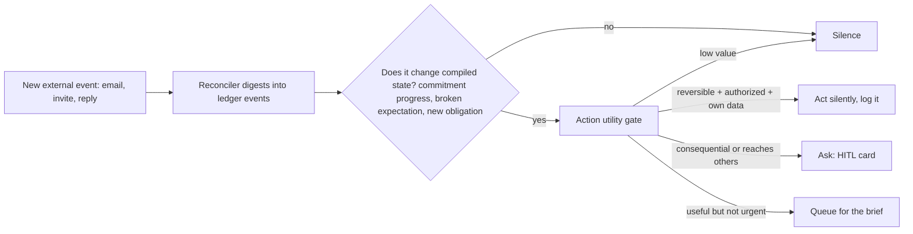

# Specification 16: Proactive v2

## 1. Overview & Objectives

The heartbeat ([Spec 06](./06_proactive_heartbeat_engine.md)) sweeps correctly at zero LLM cost, but what it sends is not yet an assistant's message ([GAP-08](./00_gap_analysis.md)). This spec fixes delivery bugs, makes briefs draw on memory, and makes a proactive message the start of a conversation.

**Amends:** Spec 06 §4–§6 (synthesis, digest, thread handoff). The zero-LLM sweep and triage gate are unchanged.

---

## 2. Bugs to Fix (verified in `knappy/heartbeat/engine.py`)

| ID | Today | Fix |
| :--- | :--- | :--- |
| **PRO-BUG-1** | `_dispatch_immediate` sets the draft's `staged_content` to `summary`, the reminder written *for the user* ("You promised Alex the deck…"). Approving sends that text to Alex. | Two separate texts: the user-facing nudge, and a draft message *to the contact*, written by the agent model in the user's voice ([Spec 13](./13_memory_system.md) communication style). |
| **PRO-BUG-2** | `recipient_identifier` falls back to `candidate["contact_name"]` when `slack_user_id` is unknown. `chat.postMessage` to a name fails after approval. | With no `slack_user_id`, try `users.lookupByEmail` with the contact's email. If that fails, show the nudge with Done and Snooze only, and no send button. |
| **PRO-BUG-3** | `cadence_due` checks `now.hour == 8` in server time. In the Docker image that is UTC. | Briefs run at 08:00 in each owner's timezone (`user_profile.timezone`, from Slack `users.info` `tz`). The tick runs every 15 minutes and picks the owners whose local time just crossed 08:00. |
| **PRO-BUG-4** | Fallback recipient `self.user_id = "user"` from `KnappyRuntime`. | Remove the placeholder. Rows without `owner_user_id` are skipped with a warning, never sent. |
| **PRO-BUG-5** | Proactive messages are not recorded anywhere, so a thread reply has no context. | Every proactive message is appended to `conversation_turns` under `thread:{dm}:{ts}` as an assistant turn. |

---

## 3. Morning Brief v2

Runs per owner at 08:00 local time, only if there is something to say: queued briefing items, commitments due today or overdue, or a dormant contact.

Input: the queued items, today's due commitments, the profile, and yesterday's `episode_daily` ([Spec 13](./13_memory_system.md)). One `agent`-tier call writes a brief:
- **Today:** what is due and what is overdue, most important first.
- **Follow-ups:** people to get back to, with why.
- **Carryover:** at most 2 open loops from yesterday's episode.

Under 150 words, in the user's preferred style. Each actionable item keeps its Block Kit buttons (Done, Snooze, Draft follow-up) from Spec 06.

If the model call fails or the budget is spent, fall back to today's bulleted list. When there is something to say, the brief always arrives.

### 3.1 Deliberate Silence

An assistant that pings on a schedule regardless of value reads as a needy app. Wave 1 rules:

- **No brief on an empty day.** No due items, no overdue items, nothing queued, no `next_check_at` hits: send nothing. Don't send "nothing today!" either.
- **Immediate DMs are rare.** At most 2 unprompted immediate DMs per owner per day outside the brief. Anything past the cap is queued for the next brief.
- **No repeats.** An item is not surfaced again until its state changes, its `next_check_at` passes, or it is snoozed and the snooze ends. (`last_alerted_at` already exists; this rule makes it binding for briefs too.)
- **Quiet hours.** Nothing between 21:00 and 08:00 owner-local, except items the triage gate scores `consequence_score ≥ 2.0` that are due before 08:00.
- **Silence is logged.** Every tick logs `owner`, candidates, and the outcome (`sent`, `queued`, `silent`) so silence can be checked, not assumed.

### 3.2 Follow-Through Checks

The sweep also selects commitments whose `next_check_at` has passed with no progress ([Spec 13](./13_memory_system.md) §2). These go through the same triage gate. The suggested action shown is the commitment's `on_no_progress` ("draft a chase to Alex"). If that action reaches another person, it is staged through HITL as usual.

---

## 4. Thread Handoff

A reply in a proactive message's thread is a normal agent conversation ([Spec 12](./12_agent_loop_v2.md) §5). Because of PRO-BUG-5's fix, the agent sees the proactive message as the previous turn. "Actually tell him I need until Monday" redrafts and re-stages. It does not create a second commitment.

---

## 5. Scope

### In-Scope
- PRO-BUG-1 through PRO-BUG-5.
- Per-owner, timezone-aware brief scheduling.
- Model-written brief with deterministic fallback.
- Deliberate silence rules (§3.1) and follow-through checks (§3.2).

### Out-of-Scope
- New sweep types (calendar-based meeting prep is wave 2, with Google Calendar).
- State-differential proactivity (§7). Designed here, built in wave 2.
- End-of-day review.
- Proactive messages in channels. Proactive output is DM only.

---

## 6. Verification

| Test Case ID | Procedure | Expected Outcome |
| :--- | :--- | :--- |
| **TEST-PRO-01** | Commitment to Alex due in 2 hours. Tick. Approve the card. | The text posted to Alex is the drafted message to Alex, not the user's reminder. |
| **TEST-PRO-02** | Same, but Alex has no `slack_user_id` and no email. | The card has Done and Snooze and no send button. |
| **TEST-PRO-03** | Owner timezone `Africa/Lagos`; server clock UTC 07:00 (08:00 Lagos). | Brief delivered to that owner. An owner in `America/Los_Angeles` gets nothing yet. |
| **TEST-PRO-04** | Two ticks in the same local 08:00 hour. | One brief. |
| **TEST-PRO-05** | Reply "push it to Monday" in a proactive thread. | The agent's prompt contains the proactive message. The due date moves. No duplicate commitment. |
| **TEST-PRO-06** | Brief model call raises. | Fallback list delivered. |
| **TEST-PRO-07** | Interaction row with an empty `owner_user_id`. | No Slack call. Warning logged. |
| **TEST-PRO-08** | Owner with nothing due, overdue, queued, or past `next_check_at`. Advance to 08:00 local. | No Slack call. Tick logged as `silent`. |
| **TEST-PRO-09** | Five commitments each qualify for an immediate DM on the same day. | Two immediate DMs. Three queued for the next brief. |
| **TEST-PRO-10** | An item was in today's brief and nothing changed. Next day's brief. | The item is not repeated. |
| **TEST-PRO-11** | Commitment with `next_check_at` yesterday, `on_no_progress="draft a chase to Alex"`, no progress event. Tick. | Surfaced with a staged chase draft to Alex behind approval. |

---

## 7. Wave 2: Proactivity as a State Differential (direction, not built in wave 1)

The schedule-driven brief is the wave 1 floor, not the end state. Following [The Instinct Thesis](https://x.com/ashwingop/article/2093026452929405356), real proactivity comes from comparing new events to compiled state, not from a timer. It needs a stream of things happening while the user is away: email arriving, calendar changes, replies. That stream only exists once wave 2 connects Gmail and Calendar, so the engine is built then.

What wave 1 already provides for it: the ledger and provenance ([Spec 13](./13_memory_system.md)) as the state to diff against, `next_check_at`/`on_no_progress`/`waiting_on` as the expectations an event can satisfy or break, the triage gate as the start of the action utility gate, and the silence rules above. Wave 2's spec adds the event sources, the diff step, and the gate's *act silently* branch. That branch needs an explicit reversibility and authority policy, informed by the profile's autonomy calibration.
