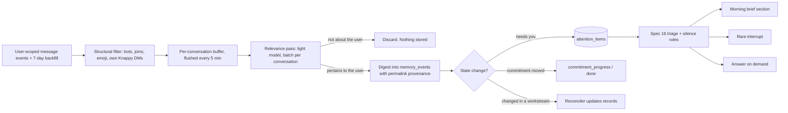

# Specification 18: Workspace Awareness

## 1. Overview & Objectives

Today Knappy only knows what you tell it. A real assistant knows the state of your work without being briefed: who is waiting on you, what moved, what changed in your projects. It tells you what you need to know and what you need to do, so you can get on with your work.

This spec makes the Slack workspace Knappy's **event stream**. Knappy reads the conversations you are part of, keeps only what pertains to you, compiles it into memory, and surfaces what needs you. This is the state-differential proactivity that [Spec 16](./16_proactive_v2.md) §7 deferred to wave 2 for lack of an event source. Slack is that source.

**Decisions (from the user, 2026-10-03):**

| Question | Decision |
| :--- | :--- |
| What Knappy may read | Every conversation the user is a member of, through a **user token**. The bot does not need to be invited anywhere. |
| The user's DMs and group DMs with other people | **Included.** This is where most requests to the user live. |
| Delivery | **Brief plus rare interrupts:** most items go to the morning brief and to "what's waiting on me?". Urgent items that need the user can interrupt under the Spec 16 silence rules. |

**Amends:** [Spec 01](./01_system_architecture_and_scope.md) §3.2 "Global Workspace Eavesdropping". Knappy still never reads beyond what *its user* can see, and never shows one user's conclusions to another. [Spec 13](./13_memory_system.md) §8, which excluded passive learning from channels.



---

## 2. Reading the Workspace

### 2.1 Token and scopes

Knappy acts for the person who installed it: the installer's **user token** (`xoxp-…`, shown under *OAuth & Permissions → User OAuth Token* after reinstall), stored as `SLACK_USER_TOKEN`. Wave 1 is single-user. Per-user OAuth installs for a whole team are out of scope (§8).

User scopes added to `slack/manifest.yml`: `channels:history`, `groups:history`, `im:history`, `mpim:history`, `channels:read`, `groups:read`, `im:read`, `mpim:read`, `users:read`.

User-scoped event subscriptions ("Subscribe to events on behalf of users"): `message.channels`, `message.groups`, `message.im`, `message.mpim`. They arrive over the existing Socket Mode connection.

A workspace admin may have to approve user scopes. If `SLACK_USER_TOKEN` is unset, Knappy runs exactly as today and logs once that workspace awareness is off.

### 2.2 Routing

- An event received on behalf of the user (`authorizations[].user_id` = owner, not the bot) goes to **awareness**, never to the agent loop. Knappy does not reply to it.
- The user's DM with Knappy and mentions of Knappy keep their current path ([Spec 12](./12_agent_loop_v2.md)) and are not also ingested by awareness.
- Duplicate deliveries (the bot and the user are both in a channel) are deduplicated by `(channel, ts)`.

### 2.3 Backfill

On first start with a user token, and after any gap over 1 hour, read the last 7 days of each conversation the user is in through `users.conversations` and `conversations.history`, rate-limited to Slack's tier limits. This lets Knappy start out knowing the current state.

---

## 3. Relevance

Most workspace traffic is not about the user. Keeping cost and storage small is the design, not an optimization.

1. **Structural filter (no model):** drop bot messages, joins and leaves, channel topic changes, messages under 3 words with no mention of the user, and edits that don't change meaning (keep the latest version only). The user's own messages are kept, because they reveal commitments the user made to others.
2. **Buffer:** append to a per-conversation buffer. Flush after 5 minutes of quiet in that conversation, or at 30 messages.
3. **Relevance pass:** one `light`-tier structured call per flushed buffer. Input is the messages as `sender_name: clean_text (ts)`, plus a compact **relevance context**: the user's name, handle and aliases; active workstreams; the people they work with; open commitments with ids. Output per message:

```python
class Observation(BaseModel):
    ts: str                                  # source message ts
    kind: Literal[
        "asks_user",          # a question or request addressed to the user
        "assigns_user",       # work assigned to or volunteered by the user
        "waiting_on_user",    # someone blocked on the user
        "user_committed",     # the user promised something to someone
        "commitment_moved",   # progress on, or completion of, one of the user's open commitments
        "workstream_update",  # a decision, deadline change, or blocker in the user's work
        "fyi",                # relevant context the user would want, no action
    ]
    summary: str                             # one line, third person
    who: str | None                          # the other party
    due: str | None                          # ISO 8601 if stated or implied
    commitment_id: str | None                # for commitment_moved
    urgency: Literal["low", "today", "now"]
    relevance: float                         # 0-1, admission score
```

Messages that yield no observation, or relevance below `KNAPPY_AWARENESS_THRESHOLD` (default `0.5`), are discarded. **Raw message text is never stored.** Only observations are kept, with a permalink.

Cost target: ≤ $0.10 per user per day in a 50-channel workspace. Every awareness call is charged to the owner's budget ([Spec 11](./11_model_layer_gemini.md) §5). When the day's budget is spent, buffers keep only the newest 30 messages per conversation and are processed the next day.

---

## 4. Digest and State Change

Each admitted observation becomes a `memory_events` row (Spec 13 §2). New `source_type = 'slack_message'` in `memory_provenance` stores `channel:ts`, and the permalink goes in event metadata. Then, by kind:

| Kind | Effect |
| :--- | :--- |
| `asks_user`, `assigns_user`, `waiting_on_user` | Create or update an **attention item** (§5). If the user answers in the same thread later, the item resolves itself. |
| `user_committed` | `commitment_add` with `who`, `due`, and provenance, exactly like the reconciler's op. |
| `commitment_moved` | `commitment_progress` or `commitment_done` on `commitment_id`. A chase scheduled by `next_check_at` is cancelled when the expected thing arrives. |
| `workstream_update`, `fyi` | Fed to the reconciler as events, which may update `workstream`, `person`, or `decision` records. |

Every one of these keeps provenance, so `forget` and "why do you think that?" work for awareness-derived memory too.

---

## 5. Attention Items

```sql
CREATE TABLE attention_items (
    id TEXT PRIMARY KEY,
    workspace_id TEXT NOT NULL,
    owner_user_id TEXT NOT NULL,
    kind TEXT NOT NULL CHECK(kind IN ('asks_user', 'assigns_user', 'waiting_on_user')),
    summary TEXT NOT NULL,
    who TEXT,
    who_slack_id TEXT,
    channel_id TEXT NOT NULL,
    thread_ts TEXT,
    source_ts TEXT NOT NULL,
    permalink TEXT,
    due_at DATETIME,
    urgency TEXT NOT NULL,
    status TEXT NOT NULL DEFAULT 'OPEN' CHECK(status IN ('OPEN', 'ANSWERED', 'DONE', 'DISMISSED', 'SNOOZED')),
    snoozed_until DATETIME,
    last_surfaced_at DATETIME,
    created_at DATETIME DEFAULT CURRENT_TIMESTAMP,
    resolved_at DATETIME,
    UNIQUE(owner_user_id, channel_id, source_ts)
);
```

**Auto-resolution:** when the user posts in the item's thread, or in the same DM after the item, the next relevance pass marks it `ANSWERED`. Nobody should be told to reply to something they already replied to.

**Agent tools:** `list_attention(status='OPEN')` and `resolve_attention(id, status)`. Two prompt sections are added:
- the top 10 open attention items, next to open commitments ([Spec 12](./12_agent_loop_v2.md) §4);
- a rule that "what's waiting on me?", "what did I miss?", and "anything I should know?" are answered from attention items and recent `fyi` / `workstream_update` events, with permalinks.

**Drafting replies:** "reply to Sam that Thursday works" stages a `SEND_SLACK_DM`, or a new `POST_THREAD_REPLY` action for channel threads, through HITL as always. The approved message posts **as the user** with the user token, because a reply from the user's assistant bot in their name would be wrong. The card says "Post as you in #channel".

---

## 6. Delivery

Spec 16's engine and rules apply unchanged. Attention items become proactive candidates:

- **Morning brief:** a *Needs you* section (open attention items, oldest and most urgent first, at most 5, each with a permalink and Done / Snooze / Draft reply buttons) and a *Worth knowing* section (at most 3 `workstream_update` / `fyi` events since the last brief).
- **Interrupts:** only `urgency = "now"` items that need the user, through the triage gate, the 2-per-day cap, and quiet hours. An item seen in the user's own Slack activity, for example the user replied, is never surfaced.
- **Silence:** a day with nothing that needs the user produces no brief section.

---

## 7. Privacy

- Knappy reads only conversations its user is a member of, and only for that user.
- Raw messages are discarded after the relevance pass. Stored data is observations with permalinks.
- The user can exclude conversations: "stop watching #random" adds the channel to `awareness_excluded`. Excluded conversations are not read, and their past observations are forgotten through the cascade.
- `forget` works on awareness-derived memory, as on anything else.
- Answers in shared channels that draw on awareness are ephemeral ([Spec 08](./08_slack_egress.md)).

---

## 8. Scope

### In-Scope
- User token, user scopes, user-scoped events, routing, dedupe, 7-day backfill.
- Structural filter, buffering, relevance pass, observation schema, budget handling.
- Ledger events with `slack_message` provenance; commitment add, progress and done from observations; reconciler hand-off.
- `attention_items`, auto-resolution, `list_attention` and `resolve_attention`, prompt sections.
- `POST_THREAD_REPLY` HITL action, and posting approved replies as the user.
- Brief *Needs you* and *Worth knowing* sections, interrupts through Spec 16 rules.
- Per-conversation exclusion.

### Out-of-Scope
- Multiple users each installing with their own user token (team-wide OAuth). The schema is per-owner already. The install flow is later.
- Email, calendar, and other sources (wave 2). This spec's pipeline is the template for them.
- Slack `search.messages`. The event stream and backfill cover it.
- Acting without approval on anything that reaches other people.

---

## 9. Verification

| Test Case ID | Procedure | Expected Outcome |
| :--- | :--- | :--- |
| **TEST-AWARE-01** | A user-scoped `message.channels` event in a channel the bot is not in. | Routed to awareness, not the agent loop. No Slack post. |
| **TEST-AWARE-02** | The same message delivered through bot and user subscriptions. | Processed once. |
| **TEST-AWARE-03** | 30 channel messages of chit-chat. Flush. | One light call. No events, no attention items, no raw text in the DB. |
| **TEST-AWARE-04** | "<@U_OWNER> can you review the deck by Thursday?" in #design. | An `asks_user` attention item with due Thursday, permalink, and provenance. |
| **TEST-AWARE-05** | Then the user replies in that thread. Next flush. | The item becomes `ANSWERED`. It is absent from the next brief. |
| **TEST-AWARE-06** | Open commitment "chase Alex for the contract" with `next_check_at` Thursday. Alex posts "contract attached" Wednesday. | `commitment_done` (or progress) recorded. No chase on Thursday. |
| **TEST-AWARE-07** | Morning with 2 open attention items and 1 workstream update. | The brief has *Needs you* (2) and *Worth knowing* (1), each with a permalink. |
| **TEST-AWARE-08** | "what's waiting on me?" | The answer lists open attention items with links, from `list_attention`. |
| **TEST-AWARE-09** | "stop watching #random". Then a message in #random. | Not read. Past #random observations forgotten. |
| **TEST-AWARE-10** | Approve a drafted thread reply. | Posted once, with the user token, in the right thread. Nothing posted before approval. |
| **TEST-AWARE-11** | No `SLACK_USER_TOKEN`. | Knappy starts. Awareness off, logged once. All other behavior unchanged. |
| **TEST-AWARE-12** | Two owners' data (schema-level). | One owner's observations never appear in the other's prompts or tools. |
| **J-18** (journey) | 3 simulated days of a busy workspace: requests to the user, unrelated chatter, a deadline change in their project, a commitment fulfilled by someone else. | The brief surfaces exactly the requests and the deadline change. The fulfilled chase is closed. Chatter leaves no trace. |
| **J-19** (journey, deliberate silence) | 5 simulated days of busy workspace traffic with nothing about the user. | Zero interrupts, no *Needs you* section, every tick logged `silent`. |

---

## 10. Implementation Notes and Deviations

Recorded while building wave 1 (2026-10-03). Code: `knappy/awareness/` (`ingest.py`, `relevance.py`, `store.py`).

| Topic | Spec said | Built | Why |
| :--- | :--- | :--- | :--- |
| Routing | `authorizations[].user_id` = owner means awareness. | `app_mention` goes to the agent. A message that mentions the bot is left to its `app_mention`. An `im` message goes to the agent when its authorization is the bot, or when the bot token can open the channel with `conversations.info`. Every other message goes to awareness. An authorization naming another user is ignored. | Slack sends one event per app and names one installation that can see it ("we will send _one_ event and include one user", Events API docs). The owner's DM with Knappy can arrive under either the bot's or the owner's authorization, so the authorization alone cannot tell it from the owner's DM with a colleague. The bot can open only its own DMs. |
| Dedupe | By `(channel, ts)`. | An in-memory `(channel, ts)` set, buffers keyed by `ts`, a per-conversation read cursor (`awareness_cursors`), and a digest that records each `(channel:ts, observation kind)` once. | Slack already sends one event per app. The same message can still come back through catch-up, an edit, or a redelivery after a flush. |
| Backfill | On first start and after a gap over 1 hour. | A catch-up at every start and every hour. It reads each conversation from its cursor, at most 7 days back, and fetches thread replies with `conversations.replies` for parents in that window. | Buffers live only in memory, because raw text is never stored. Catching up from cursors covers restarts, gaps over an hour, and Socket Mode disconnects. When nothing is new, it costs one call per conversation. |
| Rate limits | "Slack's tier limits". | Calls are paced at 1.2 s, with `slack_sdk`'s rate-limit retry handler on the user client. | `conversations.history` is Tier 3 (50+ per minute) for internal apps. Apps distributed outside the Marketplace and created after 2025-05-29 get 1 request per minute and 15 messages. Knappy is a single-workspace internal app. |
| User scopes | Nine read scopes. | The nine read scopes plus `chat:write`. | Posting an approved reply as the user needs `chat:write` on the user token. |
| `Observation` | No completion flag. | `completed: bool` added. | It chooses `commitment_done` or `commitment_progress` for `commitment_moved`. |
| Ledger | Permalink in event metadata. | New `memory_events.metadata` column (JSON text) holding the observation kind, permalink, conversation, other party, and urgency. Event kinds stay as Spec 13 defines them: asks, assigns, waiting and fyi map to `learned`, `user_committed` to `commitment_made`, `workstream_update` to `changed`, and `commitment_moved` to `commitment_progress` or `commitment_done`. | Widening the `kind` CHECK means rebuilding a table. The observation kind is what the brief and `list_attention` read. |
| Provenance | `source_type = 'slack_message'`. | As specified. SQLite databases rebuild `memory_provenance` and `action_drafts` once to widen their CHECKs. Postgres drops and re-adds the constraints. | |
| Reconciler hand-off | Observations fed to the reconciler as events. | `workstream_update` and `fyi` summaries become turns in conversation `awareness:<channel>`. They are third-person one-liners, not raw text. A prompt rule says those turns are not the user speaking and must never create commitments. | The reconciler compiles turns. A second entry point would duplicate its admission gate. |
| Commitments from `user_committed` | `commitment_add`. | Stored like the reconciler's op. `interactions.source_type` is `DIRECT_DM` or `APP_MENTION` by channel prefix, and `raw_text` is the summary. | That CHECK has no Slack-message type. Provenance carries the real source. |
| `attention_items` | As in §5. | Adds a `channel_name` column. Timestamps are UTC text, like the other wave-1 tables. | Prompts and cards say "in #design". |
| `POST_THREAD_REPLY` | Reply in a channel thread. | Staged against an `attention_id`. It replies in the item's thread, or in the request's thread for a top-level channel message, or top-level in a DM. The executor refuses any draft whose owner is not the user token's owner. `SEND_SLACK_DM` is unchanged and still comes from the bot. | The model cannot point the user's token at an arbitrary channel. The owner check keeps the token from posting for anyone else. |
| Draft reply button | Not specified. | Runs the agent in the brief's thread with "Draft a reply to attention item <id>", which stages a `POST_THREAD_REPLY` card. | It uses the normal drafting path, so the HITL rules apply. |
| Interrupts | `urgency = "now"` through triage. | Each urgent open item is triaged once. `last_surfaced_at` records that the decision was made. | This avoids a triage call on every tick. |
| Brief | *Needs you* (5) and *Worth knowing* (3). | *Needs you* lists open items, most urgent then oldest, while they stay open. Snooze hides one for 24 h. *Worth knowing* lists updates from the last 36 h not yet briefed, highest relevance first, each once. | |
| Budget | Keep the newest 30 per conversation. | As specified: the buffer is trimmed and no call is made until spend drops below the budget. | |

**Verified offline only.** Nothing has been run against a real workspace with a user token. The routing rule assumes `conversations.info` with the bot token fails on DMs the bot is not in. That is documented Slack behavior (`channel_not_found`), but not yet observed here. `scripts/smoke.md` J-18 covers it.

**Known gaps.** A thread whose parent is older than the catch-up window is not read by catch-up; live events still deliver its new replies. `memory rebuild` wipes awareness-derived events and does not replay them. There is no "start watching #channel again" tool; deleting the row from `awareness_excluded` undoes an exclusion.
