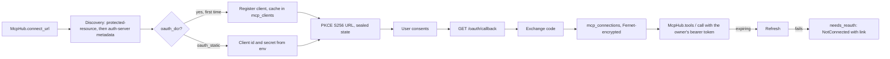

# Specification 19: MCP Connections

## 1. Overview & Objectives

Knappy can talk, remember, research, and read files. It cannot act in anyone's other tools. Wave 2 lets it act for **every workspace user** through remote MCP servers, with each user connecting their own accounts. This spec builds the connection layer: how a user connects a server, where the tokens live, and how Knappy lists and calls a connected server's tools. [Spec 20](./20_acting_through_mcp.md) puts those tools in front of the model with HITL. [Spec 21](./21_launch_connections.md) adds the launch servers.

**Principle: adding a connection is data, not code.** A new server is one entry in `mcp_servers.toml`, which `python -m knappy.mcp probe <url>` prints. No Python changes per server.

**Decisions (from the user, 2026-10-04):**

| Question | Decision |
| :--- | :--- |
| Who Knappy acts for | Every workspace user, each with their own connections. |
| How it reaches apps | Knappy is a direct MCP client and holds the OAuth tokens. No managed hub. |
| Autonomy | Every write needs approval; reads run freely. Spec 19 only classifies. Spec 20 enforces. |
| Hosting | One container. Socket Mode stays. A small aiohttp server takes `GET /oauth/callback` on `KNAPPY_CALLBACK_PORT`, reachable at `KNAPPY_PUBLIC_URL`. |



---

## 2. Server Registry (`mcp_servers.toml`, `knappy/mcp/servers.py`)

The file sits at the repo root. Each server is a `[[server]]` table:

| Field | Type | Meaning |
| :--- | :--- | :--- |
| `name` | `^[a-z][a-z0-9_]*$`, no `__` | Stable id. Spec 20 names tools `<name>__<tool>`. |
| `title` | text | What users see ("Lorikeet"). |
| `url` | http(s) URL | The streamable-HTTP MCP endpoint. |
| `auth` | `oauth_dcr` \| `oauth_static` \| `api_key` \| `service` | How Knappy gets a credential (§3). |
| `auth_group` | text, defaults to `name` | Servers in one group share one connection: one consent, one token. Gmail, Calendar and BigQuery share `google`. |
| `scopes` | list | Requested at authorization. A group requests the union of its servers' scopes. |
| `client_id_env`, `client_secret_env` | env var names | Required for `oauth_static`. |
| `token_env` | env var name | Required for `service`. |
| `tools` | `{allow = [globs], deny = [globs]}` | Which of the server's tools Knappy exposes. Default: allow all, deny none. |
| `read`, `write` | globs | Classification overrides (§6.3). |
| `body_field` | `{tool glob = argument name}` | The argument Spec 20's approval card shows as the editable body. |

Validation runs at startup. An error names the entry (`mcp_servers.toml entry 'lorikeet': ...`). Names must be unique. Servers in one `auth_group` must share `auth` and the same client env vars. A missing file is an empty registry.

---

## 3. Auth Modes (`knappy/mcp/auth.py`)

Every mode implements one interface:

```python
class AuthStrategy(Protocol):
    async def headers(self, owner: str) -> dict[str, str] | NotConnected: ...
    async def connect_url(self, owner: str) -> str | None: ...
    async def status(self, owner: str) -> Status: ...
```

`Status` is `connected`, `not_connected`, `needs_reauth`, or `unavailable`.

| Mode | Credential | `connect_url` |
| :--- | :--- | :--- |
| `oauth_dcr` | Per user, through OAuth with a dynamically registered client. | PKCE authorization URL. |
| `oauth_static` | Per user, through OAuth with the client named by `client_id_env` and `client_secret_env`. `unavailable` when either is unset. | PKCE authorization URL with `access_type=offline&prompt=consent`, so Google returns a refresh token. |
| `api_key` | Per user, a key stored encrypted by `McpHub.save_api_key`. The Slack modal that collects it is Spec 20's. | None. |
| `service` | One org-wide token from `token_env`, shared by every user. `unavailable` when unset. | None. |

### 3.1 OAuth flow

The hand-rolled flow replaces the SDK's `OAuthClientProvider`, which expects the redirect to finish inside one blocking call. That does not fit a Slack DM.

1. **Discovery.** Fetch the protected-resource metadata (RFC 9728) at `<origin>/.well-known/oauth-protected-resource<path>`, falling back to the root form. Take `authorization_servers[0]`. Fetch its metadata (RFC 8414) at `/.well-known/oauth-authorization-server`, falling back to `/.well-known/openid-configuration`, path-inserted forms first. Cached per process.
2. **Client.** `oauth_dcr` registers once per `auth_group` at `registration_endpoint` as a public client (`token_endpoint_auth_method = none`), asking only for grant types the server advertises. The result is cached in `mcp_clients` and reused until the issuer or redirect URI changes. A refused registration raises `DiscoveryError` carrying the status and the first 300 characters of the response body, so `mcp connect url failed` names the server's reason (`invalid_redirect_uri`, for example), and nothing is cached.
3. **Authorization URL.** `response_type=code`, PKCE S256, scopes, `resource=<server url>` (RFC 8707) for `oauth_dcr`, and a sealed `state`.
4. **State.** A Fernet token over `{workspace, user, auth_group, verifier, nonce}`. Fernet authenticates it, so a forged or altered state fails. It is also encrypted, so the PKCE verifier never appears in a URL. It expires 10 minutes after issue.
5. **Exchange.** The callback opens the state, posts the code with the verifier to the token endpoint, and stores the result. Clients with a secret send it as `client_secret_post`. A non-200 from the token endpoint, on exchange or refresh, raises `TokenError` with the same status and body excerpt.
6. **Refresh.** Before each use, if fewer than 5 minutes remain, refresh under a per-connection lock. A rotated refresh token replaces the old one; a missing one keeps it. When the refresh fails, or there is no refresh token, the connection becomes `needs_reauth`.

---

## 4. Storage

```sql
CREATE TABLE mcp_clients (
    auth_group TEXT PRIMARY KEY,
    issuer TEXT NOT NULL,
    redirect_uri TEXT NOT NULL,
    client_id TEXT NOT NULL,
    client_secret TEXT,          -- Fernet ciphertext
    created_at TEXT NOT NULL
);

CREATE TABLE mcp_connections (
    workspace_id TEXT NOT NULL,
    owner_user_id TEXT NOT NULL,
    auth_group TEXT NOT NULL,
    access_token TEXT NOT NULL,  -- Fernet ciphertext
    refresh_token TEXT,          -- Fernet ciphertext
    expires_at TEXT,
    scopes TEXT NOT NULL DEFAULT '',
    status TEXT NOT NULL CHECK(status IN ('connected', 'needs_reauth')),
    updated_at TEXT NOT NULL,
    PRIMARY KEY (workspace_id, owner_user_id, auth_group)
);
```

Both dialects. One connection per (workspace, user, auth group). Reconnecting overwrites it. `KNAPPY_SECRET_KEY` is any string; Knappy derives separate Fernet keys for tokens and for state from it with SHA-256. Rotating the secret orphans stored tokens, so users reconnect.

---

## 5. Callback (`knappy/mcp/callback.py`)

An aiohttp app with one route, `GET /oauth/callback`:

- `state` missing, forged, or older than 10 minutes: 400, nothing stored.
- `error` from the authorization server: 400 naming it, nothing stored.
- Code exchange fails: 502, nothing stored.
- Success: store the tokens, drop the owner's cached tool lists, call the injected `on_connected(user_id, auth_group)`, and return a page saying the app is connected and the tab can close. Spec 20 wires `on_connected` to a Slack DM.

---

## 6. `McpHub` (`knappy/mcp/hub.py`)

### 6.1 Contract

| Method | Returns |
| :--- | :--- |
| `tools(owner)` | `list[McpTool]` from every server the owner can reach: name, title, description, input schema, and `read` or `write`. Tools filtered by `tools.allow` and `tools.deny`. Cached per (owner, server) for 10 minutes. A server that is not connected, or fails to list, contributes nothing. |
| `call(owner, server, tool, args)` | `McpResult(text, is_error, structured)`, or `NotConnected`. |
| `classify(server, tool)` | `read` or `write` (§6.3). |
| `connect_url(owner, server)` | The authorization link, or `None` for modes without one. |
| `status(owner)` | `{server: Status}` for every configured server. |
| `complete(state, code)` | Used by the callback. Returns `(user_id, auth_group)`. |
| `save_api_key(owner, server, key)` | Stores an `api_key` credential. |

### 6.2 `NotConnected`

A missing, expired, or unrefreshable connection is a value, not an exception: `NotConnected(server, title, status, connect_url)`. Spec 20 turns it into "connect Lorikeet first: <link>". A `401` from the MCP server on a call marks the connection `needs_reauth` and returns `NotConnected` too.

### 6.3 Classification

`read` only when a `read` glob matches the tool, or when the tool's `readOnlyHint` is true and no `write` glob matches. Everything else, including an unannotated tool, is `write`.

| `read` glob matches | `write` glob matches | `readOnlyHint` | Result |
| :--- | :--- | :--- | :--- |
| yes | any | any | `read` |
| no | no | true | `read` |
| no | yes | true | `write` |
| no | no | false or absent | `write` |

### 6.4 Sessions

Each `tools` refresh and each `call` opens a streamable-HTTP session with the `mcp` SDK's `Client`, sends `Authorization: Bearer <token>`, and closes it. The owner's token is resolved for that call alone, so one user's request cannot carry another's credential.

---

## 7. Probe (`python -m knappy.mcp probe <url>`)

Runs discovery (§3.1) against the live server and prints a ready-to-paste entry:

- `auth = "oauth_dcr"` when the authorization server has a `registration_endpoint`; otherwise `oauth_static` with `client_id_env` and `client_secret_env` named after the auth server (`accounts.google.com` gives `GOOGLE_OAUTH_CLIENT_ID`) and `auth_group` set to that name.
- `scopes` from the protected resource's `scopes_supported`, else the auth server's, with a comment to trim them.
- A comment when no `refresh_token` grant is advertised: users reconnect when the token expires.

---

## 8. Configuration

| Variable | Default | Meaning |
| :--- | :--- | :--- |
| `KNAPPY_PUBLIC_URL` | unset | The HTTPS origin that reaches the callback port. The redirect URI is `<KNAPPY_PUBLIC_URL>/oauth/callback`. |
| `KNAPPY_SECRET_KEY` | unset | Seeds token and state encryption. |
| `KNAPPY_CALLBACK_PORT` | `8080` | Port for the callback server. |

MCP is **off** when either of the first two is unset. Knappy then builds no hub, starts no server, and behaves exactly as before. Client ids and secrets for `oauth_static` servers are read from the env vars each entry names.

---

## 9. Scope

### In-Scope
- `mcp_servers.toml` and its loader, the four auth modes, the two tables, the callback server, `McpHub`, the probe, the configuration, and starting the callback server in `main.py`.

### Out-of-Scope
- Tools reaching the model, `connect_app`, `list_apps`, `APP_ACTION` drafts, approval cards, the executor branch, the prompt, and the `on_connected` DM ([Spec 20](./20_acting_through_mcp.md)).
- The launch server entries, the Google project, the Dockerfile port, and the live run ([Spec 21](./21_launch_connections.md)).
- Revoking tokens at the provider on disconnect.

---

## 10. Verification

`tests/test_19_mcp_connections.py` runs against an in-process fake OAuth server (aiohttp: metadata, DCR, authorize, token) and a fake MCP server (`mcp` SDK `MCPServer` over streamable HTTP, with one read-annotated tool and one unannotated tool).

| Test Case ID | Procedure | Expected Outcome |
| :--- | :--- | :--- |
| **TEST-MCP-01** | Two users connect the same DCR server. | One registration. Both connected. |
| **TEST-MCP-02** | Callback with a forged state, then with a state 11 minutes old. | 400 both times. No connection stored. |
| **TEST-MCP-03** | Read `mcp_connections` raw after connecting. | Neither the access nor the refresh token appears in the row. |
| **TEST-MCP-04** | Clock moves to 4 minutes before expiry. Call a tool. | One refresh. The call carries the new token. |
| **TEST-MCP-05** | Same, with the token endpoint refusing refresh. | `NotConnected(status="needs_reauth")` with a connect URL. `status()` agrees. |
| **TEST-MCP-06** | A and B connected. Each calls the token-echo tool. | Each sees only their own token. An unconnected user gets `NotConnected`. |
| **TEST-MCP-07** | The §6.3 table, plus `tools()` against the fake server. | Annotated tool `read`, unannotated `write`, overrides win, denied tool absent. |
| **TEST-MCP-08** | `oauth_static` group of two servers. | URL has `access_type=offline` and `prompt=consent`. One connect makes both `connected`. Without the env vars, both `unavailable`. |
| **TEST-MCP-09** | `service` and `api_key` servers. | Service is connected from env. API key is `not_connected` until saved, then calls carry it. |
| **TEST-MCP-10** | No `KNAPPY_PUBLIC_URL` or `KNAPPY_SECRET_KEY`. | No hub, no callback server. |
| **TEST-MCP-11** | Invalid entries. | The error names the entry. |
| **TEST-MCP-12** | `tests/test_19_mcp_probe.py`: probe against recorded Lorikeet, Grain and Gmail metadata. | `oauth_dcr`, `oauth_dcr` with a no-refresh note, `oauth_static` in group `google`. Each output loads as a valid entry. |
| **TEST-MCP-13** | The registration endpoint answers 400 with an OAuth error body. Ask for a connect URL. | No URL. The warning log carries the error code and description. |

`tests/test_19_mcp_conformance.py` is parametrized over every entry in `mcp_servers.toml`: the entry validates, its globs compile, and the env vars its mode needs are present or the test skips naming them.

---

## 11. Implementation Notes and Deviations

Recorded while building (2026-10-04). Code: `knappy/mcp/` (`servers.py`, `auth.py`, `store.py`, `hub.py`, `callback.py`, `__main__.py`).

| Topic | Plan said | Built | Why |
| :--- | :--- | :--- | :--- |
| OAuth module | `knappy/mcp/oauth.py` | `knappy/mcp/auth.py` | It holds all four modes, not only OAuth. |
| `AuthStrategy` | `authorize_url`, `exchange`, `refresh`, `headers` | `headers`, `status`, `connect_url`. Exchange and refresh are inside `OAuthAuth`. | Service and API-key modes have no exchange or refresh. Forcing them to implement both would add dead methods. |
| Pending authorizations | Not specified | No table. The sealed `state` carries the PKCE verifier. | Fernet authenticates, encrypts, and timestamps it, which covers "signed, bound, expires in 10 minutes". |
| `mcp_clients` key | `server` | `auth_group`, reused only while the issuer and redirect URI match | The registered client belongs to the authorization, which is per group. A new `KNAPPY_PUBLIC_URL` re-registers automatically. |
| Store | `knappy/db/repository.py` | `knappy/mcp/store.py`, on `repo.connection` like `AwarenessStore` | It keeps encryption next to the only code that reads the tables. |
| Google env vars | `GOOGLE_OAUTH_CLIENT_ID` and `GOOGLE_OAUTH_CLIENT_SECRET` in `Settings` | Each `oauth_static` entry names its env vars. | A new non-DCR provider needs no Python change. |
| `resource` parameter | Always | `oauth_dcr` only | MCP auth servers expect RFC 8707. Google's endpoint is not an MCP auth server and gets `access_type` and `prompt` instead. To confirm in the Spec 21 live run. |
| 401 from an MCP server | Not specified | Marks the connection `needs_reauth` and returns `NotConnected`. | The SDK folds the HTTP 401 into a generic `MCPError`, so the hub records response statuses with an httpx event hook. |
| SDK | `FastMCP` | `mcp` 2.3, where `FastMCP` is `MCPServer`. The hub uses `mcp.Client` over `streamable_http_client` with `create_mcp_http_client` for headers. | Current major version. `create_mcp_http_client` lives in a private module (`mcp.shared._httpx_utils`). |
| Callback logging | Not specified | No aiohttp access log. | The query string carries the authorization code. |

**Verified.** The Postgres DDL, its upserts, and the decrypt round trip ran against a local PostgreSQL 14. The probe ran against the live Lorikeet, Grain, and Gmail endpoints, and its recorded metadata is in `tests/fixtures/mcp_discovery.json`.

**Known gaps.** The `Dockerfile` neither copies `mcp_servers.toml` nor exposes the callback port (Spec 21). `state` is not single-use within its 10 minutes. Replaying it also needs an unused code, and authorization servers make codes single-use. Each tool call opens a fresh MCP session. Tokens are not revoked at the provider.
