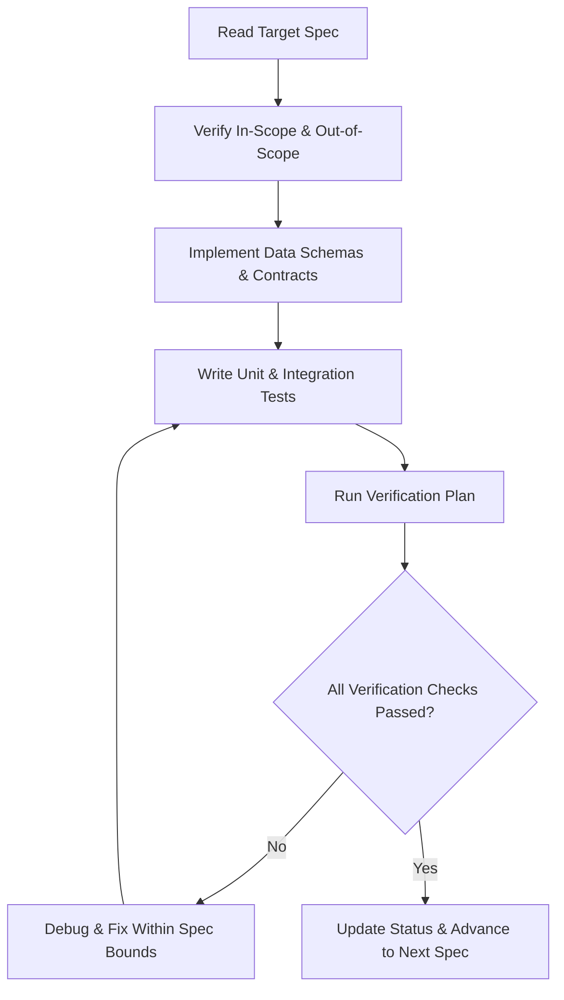

# Spec-Driven Development (SDD) — Knappy Slack Assistant

## 1. What is Spec-Driven Development (SDD)?

**Spec-Driven Development (SDD)** is an engineering discipline that prioritizes formal, structured, and testable specifications *before* generating or writing any production code. 

In AI-augmented software engineering, SDD replaces **"vibe coding"** (ad-hoc prompting, trial-and-error iterations, and loose architectural drift) with **executable contracts** and **deterministic validation criteria**.

### Comparison: Vibe Coding vs. Spec-Driven Development

| Dimension | Vibe Coding (Prompt-First) | Spec-Driven Development (Spec-First) |
| :--- | :--- | :--- |
| **Source of Truth** | Ephemeral LLM context & chat history | Structured, committed specification documents |
| **Workflow** | Ad-hoc iterative prompt tweaks | Formal specify $\rightarrow$ review $\rightarrow$ implement $\rightarrow$ verify loop |
| **Scope Management** | Prone to scope creep & unintended features | Explicit `In-Scope` vs. `Out-of-Scope` boundaries |
| **Verification** | "It seems to work when I tested once" | Deterministic test matrix & acceptance criteria |
| **Architectural Drift** | High (models refactor without contract constraints) | Zero (code must conform to interface contracts) |
| **Cost & Token Efficiency** | High token waste from repeated agent corrections | Low token consumption via focused, single-purpose tasks |

---

## 2. Core Pillars of a Production Specification

Every specification in this directory adheres to four non-negotiable pillars:

1. **Explicit Scope Boundaries (`In-Scope` vs. `Out-of-Scope`)**:
   - Defining what *not* to build is as vital as defining what to build. This prevents agent rabbit holes, token bloat, and enterprise permission overreach.
2. **Deterministic Data Contracts**:
   - Exact schemas, TypeScript/Pydantic types, SQL DDLs, and Slack Block Kit JSON structures.
3. **Architectural Grounding**:
   - Clean alignment with proven architectural design patterns (e.g., Google Cloud's Sequential, ReAct, and HITL patterns).
4. **Verification Plan & Acceptance Criteria**:
   - Every requirement has a corresponding automated test, contract test, or manual verification step before code is marked complete.

---

## 3. Specifications Index for Knappy Slack Assistant

The specifications are organized modularly to enable incremental, verified implementation:

| Spec File | Topic | Core Design Pattern | Key Deliverable |
| :--- | :--- | :--- | :--- |
| [01_system_architecture_and_scope.md](./01_system_architecture_and_scope.md) | System Overview, Topology & Master Scope | Hybrid Agentic AI | Architectural blueprint, overall In/Out Scope matrix |
| [02_slack_infrastructure_and_storage.md](./02_slack_infrastructure_and_storage.md) | Slack Socket Mode & Dual-Memory Layer | Relational + Vector Storage | Slack Bolt router, SQLite/PostgreSQL schemas (`sqlite-vec` / `pgvector`) |
| [03_sequential_ingestion_pipeline.md](./03_sequential_ingestion_pipeline.md) | Passive Ingestion & Entity Extraction | Sequential Pattern (Zero LLM Orchestration) | Regex noise filter, Pydantic extraction model, local CPU embeddings |
| [04_conversational_react_agent.md](./04_conversational_react_agent.md) | Conversational Reasoning & Tool Calling | ReAct Pattern (Thought-Action-Observation) | Dynamic tool registry, thread-isolated conversational loop |
| [05_hitl_approval_gateways.md](./05_hitl_approval_gateways.md) | Human-in-the-Loop Execution Safety Gate | HITL Pattern (Two-Phase Commit) | Staged `action_drafts`, Slack Block Kit cards, HMAC user authorization |
| [06_proactive_heartbeat_engine.md](./06_proactive_heartbeat_engine.md) | Scheduled Briefings & Deadline Monitors | Evaluator-Optimizer / Monitor Pattern | Zero-LLM deterministic SQL scanner, proactive DM generator, thread handoff |
| [07_verification_plan_and_test_matrix.md](./07_verification_plan_and_test_matrix.md) | Master Test Harness & QA Validation | End-to-End Verification | Automated pytest fixtures, mock Slack harness, cost & latency benchmarks |

---

## 4. Execution Workflow for Coding Agents

When implementing features from these specifications, follow this operational protocol:

