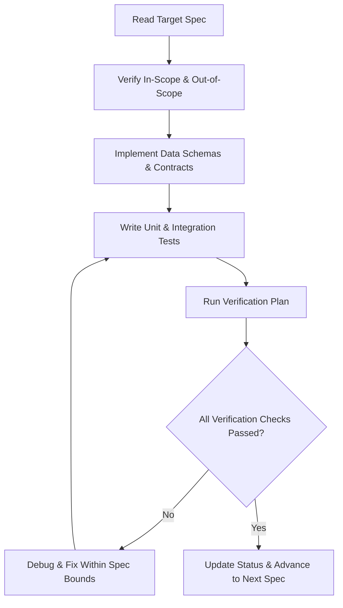

# Spec-Driven Development (SDD) — Knappy Slack Assistant

## 1. What is Spec-Driven Development (SDD)?

**Spec-Driven Development (SDD)** is an engineering discipline that prioritizes formal, structured, and testable specifications *before* generating or writing any production code. 

In AI-augmented software engineering, SDD replaces **"vibe coding"** (ad-hoc prompting, trial-and-error iterations, and loose architectural drift) with **executable contracts** and **deterministic validation criteria**.

### Comparison: Vibe Coding vs. Spec-Driven Development

| Dimension | Vibe Coding (Prompt-First) | Spec-Driven Development (Spec-First) |
| :--- | :--- | :--- |
| **Source of Truth** | Ephemeral LLM context & chat history | Structured, committed specification documents |
| **Workflow** | Ad-hoc iterative prompt tweaks | Formal specify $\rightarrow$ review $\rightarrow$ implement $\rightarrow$ verify loop |
| **Scope Management** | Prone to scope creep & unintended features | Explicit `In-Scope` vs. `Out-of-Scope` boundaries |
| **Verification** | "It seems to work when I tested once" | Deterministic test matrix & acceptance criteria |
| **Architectural Drift** | High (models refactor without contract constraints) | Zero (code must conform to interface contracts) |
| **Cost & Token Efficiency** | High token waste from repeated agent corrections | Low token consumption via focused, single-purpose tasks |

---

## 2. Core Pillars of a Production Specification

Every specification in this directory adheres to four non-negotiable pillars:

1. **Explicit Scope Boundaries (`In-Scope` vs. `Out-of-Scope`)**:
   - Defining what *not* to build is as vital as defining what to build. This prevents agent rabbit holes, token bloat, and enterprise permission overreach.
2. **Deterministic Data Contracts**:
   - Exact schemas, TypeScript/Pydantic types, SQL DDLs, and Slack Block Kit JSON structures.
3. **Architectural Grounding**:
   - Clean alignment with proven architectural design patterns (e.g., Google Cloud's Sequential, ReAct, and HITL patterns).
4. **Verification Plan & Acceptance Criteria**:
   - Every requirement has a corresponding automated test, contract test, or manual verification step before code is marked complete.

---

## 3. Specifications Index for Knappy Slack Assistant

The specifications are organized modularly to enable incremental, verified implementation:

| Spec File | Topic | Core Design Pattern | Key Deliverable |
| :--- | :--- | :--- | :--- |
| [01_system_architecture_and_scope.md](./01_system_architecture_and_scope.md) | System Overview, Topology & Master Scope | Hybrid Agentic AI | Architectural blueprint, overall In/Out Scope matrix |
| [02_slack_infrastructure_and_storage.md](./02_slack_infrastructure_and_storage.md) | Slack Socket Mode & Dual-Memory Layer | Relational + Vector Storage | Slack Bolt router, SQLite/PostgreSQL schemas (`sqlite-vec` / `pgvector`) |
| [03_sequential_ingestion_pipeline.md](./03_sequential_ingestion_pipeline.md) | Passive Ingestion & Entity Extraction | Two-Tier Sequential Gate | Local structural filter + TypeSafe AI Jev System 1 gate, Pydantic extraction, local CPU embeddings |
| [04_conversational_react_agent.md](./04_conversational_react_agent.md) | Conversational Reasoning & Tool Calling | Hybrid Jev Routing + ReAct Loop | Sub-100ms Fast-Path Intent Router (Jev System 1), direct tool dispatch, and multi-hop ReAct loop |
| [05_hitl_approval_gateways.md](./05_hitl_approval_gateways.md) | Human-in-the-Loop Execution Safety Gate | HITL Pattern (Two-Phase Commit) | Staged `action_drafts`, Slack Block Kit cards, user authorization check, atomic CAS idempotency |
| [06_proactive_heartbeat_engine.md](./06_proactive_heartbeat_engine.md) | Scheduled Briefings & Deadline Monitors | Monitor Pattern + Jev Alert Triage | Zero-LLM deterministic SQL scanner, Jev alert triage gate (fatigue prevention), proactive DM generator |
| [07_verification_plan_and_test_matrix.md](./07_verification_plan_and_test_matrix.md) | Master Test Harness & QA Validation | End-to-End Verification | Automated pytest fixtures, mock Slack harness, TypeSafe Jev fixtures, cost & latency benchmarks |
| [08_slack_egress.md](./08_slack_egress.md) | Slack replies, approval sends, reminder DMs, per-user memory | Egress + owner partition | Bolt posts, one-shot `SEND_SLACK_DM`, `owner_user_id`, Postgres URL |
| [09_slack_history_context.md](./09_slack_history_context.md) | Recent invited Slack history | Read-only context tool | `search_slack_history`, `channels:history`, `groups:history` |
| [10_seeded_e2e_conversations.md](./10_seeded_e2e_conversations.md) | Seeded Slack conversations | End-to-end post assertions | File SQLite seed, path logs, visible fallback when a post fails |

### Wave 1: personal assistant (talk, remember, research, read)

Start with [00_gap_analysis.md](./00_gap_analysis.md): it explains why specs 01–10 produce a reminder bot rather than a personal assistant, and maps each gap to the spec that closes it. Build order: `11 → 12 → 13 → 17 (offline) → 14 → 15 → 16`.

| Spec File | Topic | Core Design Pattern | Key Deliverable |
| :--- | :--- | :--- | :--- |
| [00_gap_analysis.md](./00_gap_analysis.md) | Vision vs. today | Traceability | Gap table GAP-01…10 with closing specs |
| [11_model_layer_gemini.md](./11_model_layer_gemini.md) | Model layer | Single client, typed calls | `knappy/llm/` Gemini client, tiers, budget, `FakeModel` |
| [12_agent_loop_v2.md](./12_agent_loop_v2.md) | Agent loop | Model-driven tool loop | Default path for every message, prompt assembly, sessions, placeholder UX |
| [13_memory_system.md](./13_memory_system.md) | Memory | Instinct-style write-path reconciliation | Admission-gated reconciler, semantic ledger with provenance, typed aliased records, profile one-pager, recompile from source |
| [14_web_research.md](./14_web_research.md) | Web | Read-only tools | `web_search` (grounded), `fetch_url` with SSRF guard, citations |
| [15_files_and_documents.md](./15_files_and_documents.md) | Files | Ingest + deliver | Read shared files, searchable documents, `create_document` to own DM |
| [16_proactive_v2.md](./16_proactive_v2.md) | Proactive fixes | Monitor pattern, amended | Correct follow-up drafts, per-timezone briefs, deliberate silence, follow-through checks; state-diff design for wave 2 |
| [17_end_to_end_acceptance.md](./17_end_to_end_acceptance.md) | Acceptance | Journeys at three levels | J-01…J-17, the definition of done for wave 1, memory journeys weighted highest |
| [18_workspace_awareness.md](./18_workspace_awareness.md) | Workspace awareness | Event stream + state diff | User-token reading of your conversations, relevance pass, attention items, *Needs you* brief section |
| [19_mcp_connections.md](./19_mcp_connections.md) | MCP connections | Per-user OAuth + MCP client | Server registry, four auth modes, encrypted tokens, OAuth callback, `McpHub` |
| [20_acting_through_mcp.md](./20_acting_through_mcp.md) | Acting through MCP | ReAct + HITL | App tools per user, reads run, writes become `APP_ACTION` approval cards |

---

## 4. Execution Workflow for Coding Agents

When implementing features from these specifications, follow this operational protocol:

